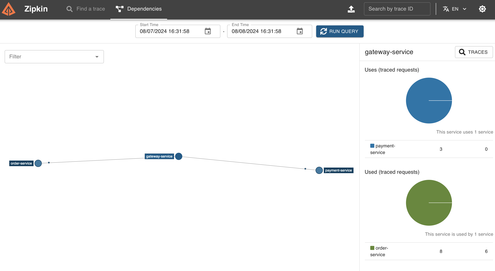

# Spring Cloud 速成 Ch10 GateWay 网关

Spring Cloud Gateway 是 Spring Cloud 的一个全新项目，它旨在为微服务架构提供一种简单有效的统一的 API 路由管理方式。

不过在学习 Gateway 前，我们先来复习一下计算机网络。

## 网关

计算机网络有 OSI 七层模型（理论模型）和 TCP/IP 四层模型（实际模型）。

OSI 模型包括（自下而上）：

1. 物理层，即计算机网络依赖的物理设备，如网线、交换机等。
2. 数据链路层，即计算机网络物理设备之间连接及其数据传输的协议，重要的概念有以太网协议，MAC 地址，交换机等。这一层相比于网络层，需要考虑物理上的限制，基于 MAC 地址进行数据传输。
3. 网络层，即在数据链路层支持了数据传输的基础上，如何在多个网络之间传输数据，重要的概念有 IP 地址，路由器等。这一层相比于数据链路层，只考虑逻辑上的网络连接，基于 IP 地址进行数据传输。
4. 传输层，即在网络层支持了数据传输的基础上，如何在端到端的连接中传输数据，重要的概念有 TCP 协议，UDP 协议等。这一层相比于网络层，只考虑端到端的连接，基于端口号进行数据传输。
5. 会话层，即在传输层支持了数据传输的基础上，如何在应用程序之间建立连接，重要的概念有会话控制，会话同步等，常用的技术有 RPC，Restful 等。
6. 表示层，即在会话层支持了数据传输的基础上，如何在应用程序之间传输数据，重要的概念有数据格式转换，数据加密等。
7. 应用层，即在表示层支持了数据传输的基础上，如何在应用程序之间传输数据，重要的概念有 HTTP 协议，FTP 协议，DNS 协议等。

TCP/IP 模型包括（自下而上）：

1. 网络接口层，对应 OSI 模型的物理层和数据链路层。
2. 网际层，对应 OSI 模型的网络层。
3. 传输层，对应 OSI 模型的传输层。
4. 应用层，对应 OSI 模型的会话层、表示层和应用层。

在计算机网络中，网关是一个网络节点，用于连接两个网络，实现数据的转发。网关是 OSI 模型中的第三层设备，它可以实现不同网络之间的数据传输，是网络层的一个设备。

例如，我们的家庭网络连接了互联网，那么家庭网络的路由器可以作为一个网关，将家庭网络和互联网连接起来。对于公司部署好的软件，我们可以将网关部署在公司的服务器上，实现公司内部网络和互联网之间的数据传输。

## Spring Gateway 三大核心概念

Spring Gateway 有三大核心概念：

- 断言（Predicate）：用于匹配 HTTP 请求的属性，如请求路径、请求参数等。注意，这个断言和 assert 完全不是一个意思，是翻译的问题。Predicate 正确的翻译应该是谓词或者判定器、判据，也就是一些用来判断某物是否符合某条件的函数。
- 过滤器（Filter）：用于修改 HTTP 请求和响应的属性，如请求头、请求体等。可以加在断言之前或之后。
- 路由（Route）：用于将断言和过滤器组合在一起，实现请求的转发。

在接受到请求后，首先检查路由，把请求发送到对应的路由上。然后，检查断言，如果断言匹配，则执行过滤器，修改请求和响应。最后，将请求发送到目标服务。

如果用类似代码的方式来描述，可以用下面的伪代码：

```java
void gatewayHandleRequest(Request request) {
    for (Route route : routes) {
        boolean match = true;
        for (Predicate predicate : route.getPredicates()) {
            match &= predicate.test(request);
        }
        if (!match) continue;
        for (Filter filter : route.getFilters()) {
            filter.filter(request);
        }
        route.forward(request);
        return;
    }
}
```

## 创建 Gateway

Gateway 本身也是一个微服务，要注册到注册中心中。

因此我们创建一个 Spring 子项目，要包括之前 Consul 的依赖，以及 Gateway 的依赖。

```groovy
dependencies {
    implementation 'org.springframework.boot:spring-boot-starter-actuator'
    implementation 'org.springframework.cloud:spring-cloud-starter-consul-discovery'
    implementation 'org.springframework.cloud:spring-cloud-starter-bootstrap'
    implementation 'org.springframework.cloud:spring-cloud-starter-consul-config'
    implementation 'org.springframework.cloud:spring-cloud-starter-gateway:4.1.5'
}
```

因为使用的 spring boot 版本，因此直接启动项目即可在 Consul 注册网关。

我们把网关改到 9527 端口。

## 基于配置文件进行路由映射

对于简单的路由映射，我们可以使用配置文件来实现。

```yaml
spring:
  cloud:
    gateway:
      routes:
        - id: payment-service
          uri: lb://payment-service
          predicates:
            - Path=/**
```

这里的 uri 可以直接写 http 地址。但是如果写 `lb://`，则表示 load balanced，这样就可以使用服务名来访问服务。

id 是任意的，但是要唯一。这里的 predicates 是路由转发的条件，这里表示所有的请求都转发到 payment-service 服务。

这样之后，就可以直接通过网关访问 payment 服务了，例如`localhost:9527/payment`。

如果需要让其它的服务也过网关，修改它们调用的 URI 即可，即下面这样

```java
// @HttpExchange("http://payment-service/payment")
@HttpExchange("http://gateway-service/payment")
```

我们可以在 ZipKin 中看到，现在 order 请求先经过了网关，网关再转发到 payment 服务。



## 基于 Bean 进行路由映射

除了配置文件，我们还可以使用 Bean 来配置路由。

```java
@Configuration
public class GatewayConfig {

    @Bean
    public RouteLocator customRouteLocator(RouteLocatorBuilder builder) {
        return builder.routes()
                .route("payment-service", r -> r.path("/payment/**")
                        .uri("lb://payment-service"))
                .build();
    }
}
```

## Predicate

Predicate 是用来匹配请求的条件，可以根据请求的路径、请求的参数等来匹配。之前我们只用了 Path 断言，还有很多其它的断言，具体可参考[官方文档](https://docs.spring.io/spring-cloud-gateway/reference/spring-cloud-gateway/request-predicates-factories.html)，其它 Predicate 的写法都要参考文档。

内建的 Predicate 有：

- After，请求时间在某个时间之后
- Before，请求时间在某个时间之前
- Between，请求时间在两个时间之间
- Cookie，请求中包含某个 Cookie
- Header，请求头中包含某个值
- Host，请求的 Host 匹配
- Method，请求的方法匹配
- Path，请求的路径匹配
- Query，请求的参数匹配
- RemoteAddr，请求的 IP 地址匹配

Predicate 配置方式有两种，一种叫 Shortcut，即简化的配置方式，另一种叫 Full Expanded，即完全展开的配置方式。

这种配置方式是 Shortcut，即简化的配置方式。

```yaml
spring:
  cloud:
    gateway:
      routes:
        - id: payment-service
          uri: lb://payment-service
          predicates:
            - Path=/**
            - Query=**
```

这种配置方式是 Full Expanded，即完全展开的配置方式。

```yaml
spring:
  cloud:
    gateway:
      routes:
        - id: payment-service
          uri: lb://payment-service
          predicates:
            - name: Path
              args:
                pattern: /**
```

当然，也可以使用 Bean 来配置，但是这里不再赘述。

## 自定义 Predicate

所有的 Predicate 都需要一个 RoutePredicateFactory 工厂来产生。需要自定义 Predicate 时，需要继承 AbstractRoutePredicateFactory 类。

注意，类名应当以 RoutePredicateFactory 结尾，因为 Gateway 会自动扫描这些类。

@Validated 注解是 Spring 的注解，用于校验配置是否正确。ServerWebExchange 类似于 HttpServletRequest，用于获取请求的信息。

```java
@Component
public class CustomPredicateFactory extends AbstractRoutePredicateFactory<CustomPredicateFactory.Config> {
    @Validated
    public class CustomConfig {
        // configurations needed for this predicate
        @Data
        String secret;
    }

    public CustomPredicateFactory() {
        super(Config.class);
    }

    @Override
    public List<String> shortcutFieldOrder() {
        // return the order of the arguments
        return Arrays.asList("secret");
    }

    @Override
    public Predicate<ServerWebExchange> apply(Config config) {
        // return a Predicate
        return new Predicate<ServerWebExchange>() {
            @Override
            public boolean test(ServerWebExchange exchange) {
                // test the exchange
                String secret = exchange.getRequest().getQueryParams().getFirst("secret");
                return secret != null && secret.equals(config.secret);
            }
        };
    }
}
```

添加之后，在 yml 文件中使用时，Full Expanded 的方式如下：

```yaml
spring:
  cloud:
    gateway:
      routes:
        - id: payment-service
          uri: lb://payment-service
          predicates:
            - name: Custom
              args:
                secret: 123
```

而 Shortcut 的方式如下，其中参数用逗号分隔，顺序与上面的 ShortcutFieldOrder 返回值一致。

```yaml
spring:
  cloud:
    gateway:
      routes:
        - id: payment-service
          uri: lb://payment-service
          predicates:
            - Custom=123
```

Predicate 的名字 Custom，这是类名的去掉 PredicateFactory 后的部分。

## Filter

Spring Gateway 中 Filter 有两种，一种是 Global Filter，一种是 Gateway Filter。前者作用于所有的路由，后者作用于单个路由。但是，前者我们一般不需要去动它们的默认配置。

Gateway Filter 用于修改请求和响应，例如添加请求头、修改请求体等。全部写法具体有很多，具体可参考[官方文档](https://docs.spring.io/spring-cloud-gateway/reference/spring-cloud-gateway/gatewayfilter-factories.html)。

内建的 Filter 有：

- 请求头相关
    + AddRequestHeader，添加请求头
    + AddRequestHeaderIfNotPresent，如果请求头不存在，则添加请求头
    + SetRequestHeader，设置请求头
    + SetRequestHostHeader，设置请求的 Host 头
    + RemoveRequestHeader，移除请求头
    + MapRequestHeader，映射请求头
    + RequestHeaderSize，限制请求头的大小
- 响应头相关
    + AddResponseHeader，添加响应头
    + SetResponseHeader，设置响应头
    + FallbackHeaders，服务降级时设置响应头
    + RemoveResponseHeader，移除响应头
    + DedupeResponseHeader，删除响应头中的重复条目
    + RewriteLocationResponseHeader，重写 Location 响应头中的 URL
    + RewriteResponseHeader，重写响应头中的特定值
    + SecureHeaders，添加常见的安全相关 HTTP 头
    + RewriteLocationResponseHeader，重写 Location 响应头中的 URL
- 路径和参数相关
    + RewritePath，使用正则表达式匹配和重写请求路径
    + SetPath，设置请求路径
    + StripPrefix，去除请求路径中的指定前缀
    + PrefixPath，在请求路径前添加指定的前缀
    + AddRequestParameter，添加请求参数
    + RemoveRequestParameter，移除请求参数
    + RewriteRequestParameter，重写请求参数的值
- 请求体和响应体相关
    + ModifyRequestBody，修改请求体的内容
    + CacheRequestBody，缓存请求体
    + ModifyResponseBody，修改响应体的内容
    + RemoveJsonAttributesResponseBody，从 JSON 响应体中移除指定的属性
    + JsonToGrpc，将 JSON 格式的请求体转换为 gRPC 格式
- 流量管理和容错相关
    + CircuitBreaker，实现断路器功能
    + Retry，在请求失败时按照指定的策略重试请求
    + RequestRateLimiter，对请求进行速率限制
    + RequestSize，限制请求的大小
    + LocalResponseCache，在本地缓存响应
- 重定向和状态码相关
    + RedirectTo，将请求重定向到指定的 URI
    + SetStatus，设置响应状态码
- 认证和会话管理相关
    + TokenRelay，将 OAuth 2.0 令牌从网关传递到下游服务
    + SaveSession，保存会话信息
    + PreserveHostHeader，保留原始请求中的 Host 头

要添加 Filter，同样的，我们可以使用配置文件，也可以使用 Bean。

下面是一个添加请求头的 Filter。与之前 Predicate 里加入一个列表不同，Filter 需要传入一个 Map，key 和 value 交替。

```yaml
spring:
  cloud:
    gateway:
      routes:
        - id: payment-service
          uri: lb://payment-service
          predicates:
            - Path=/**
          filters:
            - AddRequestHeader=X-Request-Foo, Bar
```

当然，可以用全展开的方式。

```yaml
spring:
  cloud:
    gateway:
      routes:
        - id: payment-service
          uri: lb://payment-service
          predicates:
            - name: Path
              args:
                pattern: /**
          filters:
            - name: AddRequestHeader
              args:
                headerName: X-Request-Foo
                headerValue: Bar
```

同样，也可以使用 Bean 来配置，但是这里不再赘述。

## 自定义全局 Filter

自定义 GlobalFilter 需要实现`GlobalFilter`和`Ordered`接口，前者是 Filter 的接口，后者定义了一个`getOrder`方法，用于定义 Filter 的顺序，这个`getOrder`方法返回一个整数，值越小，Filter 的优先级越高。

```java
@Component
public class CustomFilter implements GlobalFilter, Ordered {
    @Override
    public Mono<Void> filter(ServerWebExchange exchange, GatewayFilterChain chain) {
        // do something
        return chain.filter(exchange);
    }

    @Override
    public int getOrder() {
        return 0;
    }
}
```

这里的`Mono`是 WebFlux 的语法，我们只会在下面用到一点点，不用太担心。如果你学过 JavaScript 的 Promise，那么 Mono 就是类似的东西。

例如，如果我们需要一个统计请求时间的 Filter，可以这样写：

```java
@Component
@Slf4j
public class RequestTimeFilter implements GlobalFilter, Ordered {
    @Override
    public Mono<Void> filter(ServerWebExchange exchange, GatewayFilterChain chain) {
        exchange.getAttributes().put("requestTimeBegin", System.currentTimeMillis());
        return chain.filter(exchange).then(
            Mono.fromRunnable(() -> {
                Long startTime = exchange.getAttribute("requestTimeBegin");
                if (startTime != null) {
                    log.info(exchange.getRequest().getURI().getRawPath() + ": " + (System.currentTimeMillis() - startTime) + "ms");
                }
            })
        );
    }

    @Override
    public int getOrder() {
        return 0;
    }
}
```

## 自定义 Gateway Filter

Gateway Filter 的自定义与 Predicate 类似，需要继承 AbstractGatewayFilterFactory 类。

```java
@Component
public class CustomGatewayFilterFactory extends AbstractGatewayFilterFactory<CustomGatewayFilterFactory.Config> {
    @Validated
    public class Config {
        // configurations needed for this filter
        @Data
        String secret;
    }

    @Override
    public List<String> shortcutFieldOrder() {
        // return the order of the arguments
        return Arrays.asList("secret");
    }

    public CustomGatewayFilterFactory() {
        super(Config.class);
    }

    @Override
    public GatewayFilter apply(Config config) {
        return new GatewayFilter() {
            @Override
            public Mono<Void> filter(ServerWebExchange exchange, GatewayFilterChain chain) {
                String secret = exchange.getRequest().getQueryParams().getFirst("secret");
                if (secret == null || !secret.equals(config.secret)) {
                    exchange.getResponse().setStatusCode(HttpStatus.UNAUTHORIZED);
                    return exchange.getResponse().setComplete();
                }
                return chain.filter(exchange);
            }
        };
    }
}
```

这里实现了一个简单的密码验证 Filter。添加之后，在 yml 文件中使用时，Full Expanded 的方式如下：

```yaml
spring:
  cloud:
    gateway:
      routes:
        - id: payment-service
          uri: lb://payment-service
          predicates:
            - name: Path
              args:
                pattern: /**
          filters:
            - name: Custom
              args:
                secret: 123
```

而 Shortcut 的方式如下，其中参数用逗号分隔，顺序与上面的 ShortcutFieldOrder 返回值一致。

```yaml
spring:
  cloud:
    gateway:
      routes:
        - id: payment-service
          uri: lb://payment-service
          predicates:
            - Path=/**
          filters:
            - Custom=123
```

一样的，Custom 是类名的去掉 GatewayFilterFactory 后的部分。
