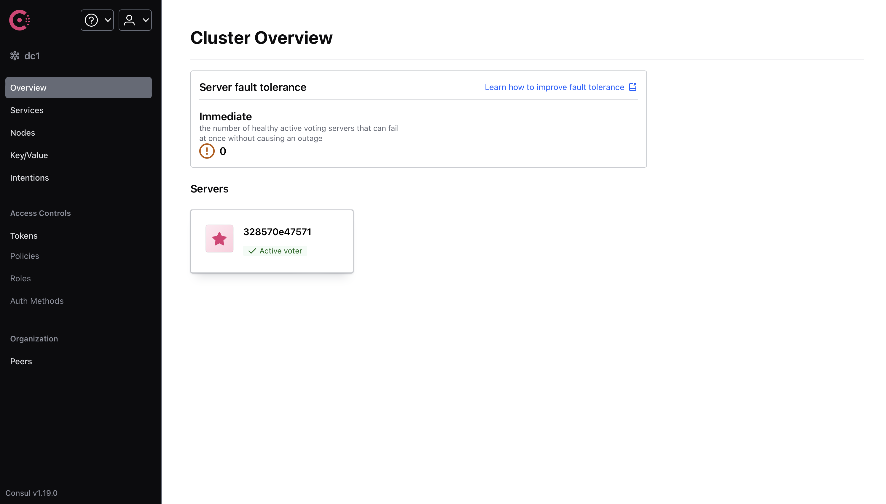
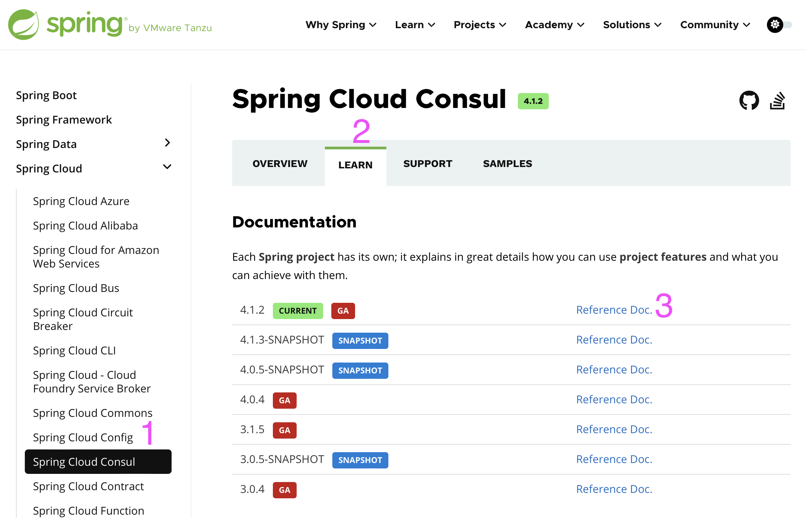
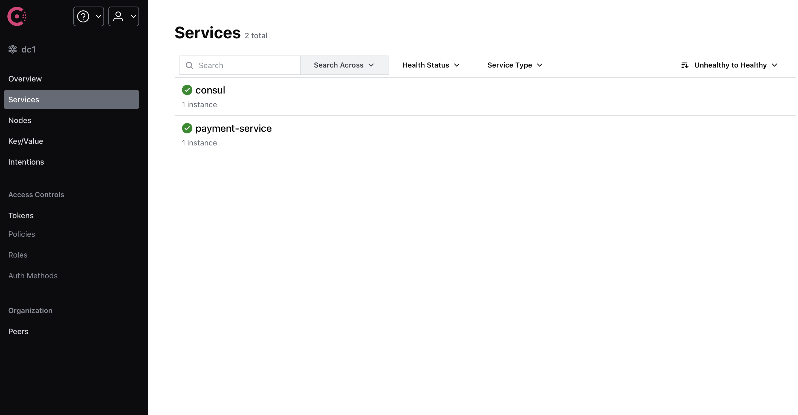

# Consul 服务注册与发现

第三章开始，我们开始学习 Spring Cloud，因此标题也改成了 Spring Cloud 速成。

本笔记 Spring Cloud 部分参考了尚硅谷阳老师的[教程](https://www.bilibili.com/video/BV1gW421P7RD)。Spring Cloud 先讲 Consul，Load Balancer，Spring Interface Client 与 OpenFeign，Resilience4j，MicroMeter，Gateway，Seata，WebFlux，Spring Security，KeyCloak，Rabbit MQ，GraphQL，gRPC 然后是 k8s。尽管上面部分技术严格讲并不属于微服务，但它们属于 Spring 的进阶内容，这里就一起讲了。

## 微服务架构

微服务架构是一种架构风格，它是一种将单一应用程序开发为一组小型服务的方法，每个服务运行在自己的进程中，服务之间通过 HTTP 或者消息队列通信。每个服务都有自己的数据库，独立部署，独立升级。

例如，像是淘宝这样的购物网站，可能有商品服务，订单服务，用户服务，支付服务等等，每个服务都跑在单独的服务器上，这样可以更好地实现高可用，高并发，高扩展。

当然，不用框架也完全可以做到微服务——我现在就用 python 写一个。

```python
from fastapi import FastAPI
api = FastAPI()
@api.get("/secret")
def get_secret():
    return "You found my secret!"
if __name__ == "__main__":
    import uvicorn
    uvicorn.run(api, host="0.0.0.0", port=8000)
```

```python
from fastapi import FastAPI
api = FastAPI()
@api.get("/secret")
def get_secret(password: str):
    if password != "123456":
        return
    import requests
    return requests.get("http://localhost:8000/secret").text
if __name__ == "__main__":
    import uvicorn
    uvicorn.run(api, host="0.0.0.0", port=8001)
```

这样就实现了一个简单的微服务架构，一个服务提供密码验证，另一个服务提供秘密信息。

当然，事情不可能这么简单，当系统开始 scale 之后，会有这样几个问题：

- 服务注册与发现：不可能全部使用 ip 地址或者域名来访问服务，因为服务可能会动态变化，需要服务注册与发现。需要一个工具来统一处理服务请求并分发给对应的服务。
- 服务调用：调用其它服务的时候，不可能总是从基础的 http 请求开始，需要一个工具来简化服务调用。
- 负载均衡：如果我们已经把每个服务部署在多个服务器上，那么如果我们需要更大的 qps，一个自然的想法就是部署更多的同一个服务。但是，这样就会创建多个服务事例，例如服务 A1，服务 A2 都提供同一个服务，为了达到更大的 qps，我们应当将所有的请求均匀分发给 A1 和 A2。这就是负载均衡。
- 服务熔断：如果一个服务出现问题，例如超时，那么我们应当停止向这个服务发送请求，而不是一直等待，并进行降级，即减少当前支持的功能，以避免雪崩，即服务集群中一个服务的故障，由于没有做好服务熔断，导致依赖这个服务的其它服务也出现故障，最终一层层向下，直到整个系统崩溃。
- 服务网关：如果我们有多个服务，那么我们应当有一个统一的入口，这个入口可以做一些统一的处理，例如鉴权，限流，日志等等。

Spring Cloud 就是为了解决这些问题而生的。不过，Spring Cloud 是一套又大又复杂的框架，现在也有公司在借助 k8s 加上容器技术实现微服务架构，这样可以不依赖于具体的语言和框架，而是可以自由选择。不过，Spring Cloud 依然是较为流行的微服务框架之一。

今天我们先介绍服务注册与发现。

## 配置 docker 网络

下文将使用 docker 部署 Consul，但是有个问题，在 macos 和 windows 上，docker本质上是运行在虚拟机上，因此不支持 host 网络模式。Consul 只能发现当前内网的服务，而我们的 java 是运行在宿主机上的。换言之，Consul 只能在 docker 运行的那个虚拟机上找服务，但这个虚拟机被隐藏了起来，不是和宿主机直通的。

当然，如果是虚拟机而不是 docker，那么可以使用 host 网络模式，这样就可以让虚拟机和宿主机在同一个网络上。但是，尽管已经支持了 host 模式，但是在 macos 和 windows 上，docker 本质上还是运行在虚拟机上，因此无法使用 host 模式。准确地说，这个 host 是 mac 和 windows 上那个 docker linux 虚拟机的 host，而非 mac 和 windows 本身。

当然你可以把 java 项目放到 docker 里面，如果在 windows 上，也可以打开 windows container 模式，或者用 linux 系统开发。

一个更好的解决方案是使用 [docker-desktop-connector](https://github.com/wenjunxiao/mac-docker-connector)。安装后按照文档配置即可。这样就可以让本机网络和 docker 虚拟机网络联通。又由于 Consul 是绑在虚拟机的 eth0 上的，因此我们可以在本机上连接到虚拟机的 eth0，从而访问 Consul。

## Consul 服务注册与发现

### 启动 Consul

首先，启动 Consul。为了方便开发，我们还一并创建一个数据库。

数据库的 schema 如下：

```sql
DROP TABLE IF EXISTS payment;

CREATE TABLE payment (
   id SERIAL PRIMARY KEY,
   payment_no VARCHAR(50) NOT NULL,
   order_no VARCHAR(50) NOT NULL,
   user_id INT DEFAULT 1,
   amount DECIMAL(8,2) NOT NULL DEFAULT 9.9,
   deleted BOOLEAN NOT NULL DEFAULT FALSE,
   create_time TIMESTAMPTZ NOT NULL DEFAULT CURRENT_TIMESTAMP,
   update_time TIMESTAMPTZ NOT NULL DEFAULT CURRENT_TIMESTAMP
);

COMMENT ON TABLE payment IS '支付交易表';
COMMENT ON COLUMN payment.payment_no IS '支付流水号';
COMMENT ON COLUMN payment.order_no IS '订单流水号';
COMMENT ON COLUMN payment.user_id IS '用户账号ID';
COMMENT ON COLUMN payment.amount IS '交易金额';
COMMENT ON COLUMN payment.deleted IS '删除标志，默认0不删除，1删除';
COMMENT ON COLUMN payment.create_time IS '创建时间';
COMMENT ON COLUMN payment.update_time IS '更新时间';
```

docker compose 文件如下：

```yaml
services:
  postgres:
    image: postgres:12.19
    environment:
      POSTGRES_USER: user
      POSTGRES_PASSWORD: password
      POSTGRES_DB: demo
    volumes:
      - ./schema.sql:/docker-entrypoint-initdb.d/schema.sql
    ports:
       - 5432:5432
  consul:
    image: hashicorp/consul:1.19
    ports:
       - 8500:8500
    volumes:
      - ./consul:/consul/data
```

启动后，访问 `http://localhost:8500`，可以看到 Consul 的界面。



注意，Consul 在 docker 容器关闭时是不会保存数据的。

### 项目配置

利用我们上一章讲的 gradle，配置一个多模块项目。

根项目使用，

```groovy
plugins {
    id 'java'
    id "org.springframework.boot" version "3.2.6"
    id 'io.spring.dependency-management' version '1.1.5'
}

allprojects {
    repositories {
        mavenCentral()
    }

    ext {
        set("springCloudVersion", "2023.0.2")
        set("springBootVersion", "3.2.6")
        set("lombokVersion", "1.18.28")
        set("springdocVersion", "2.5.0")
        set("postgresqlVersion", "42.7.3")
    }

    group = 'io.github.fingerbone'
    version = '1.0-SNAPSHOT'
}

subprojects {
    apply {
        plugin 'java'
        plugin 'org.springframework.boot'
        plugin 'io.spring.dependency-management'
    }

    java {
        sourceCompatibility = JavaLanguageVersion.of(17)
        targetCompatibility = JavaLanguageVersion.of(17)
    }

    dependencyManagement {
        imports {
            mavenBom "org.springdoc:springdoc-openapi-starter-webmvc-ui:${springdocVersion}"
            mavenBom "org.springframework.boot:spring-boot-starter-web:${springBootVersion}"
            mavenBom "org.postgresql:postgresql:${postgresqlVersion}"
            mavenBom "org.springframework.cloud:spring-cloud-dependencies:${springCloudVersion}"
        }
    }

    dependencies {
        compileOnly "org.projectlombok:lombok:${lombokVersion}"
        annotationProcessor "org.projectlombok:lombok:${lombokVersion}"
    }
}
```

注意，这里的 Spring Cloud 和 Spring Boot 版本必须匹配，否则会出现一些问题。兼容性表见 [Spring Cloud 文档](https://spring.io/projects/spring-cloud)。

为了方便，引入了 spring doc，加入 spring doc 后，可以访问`swagger-ui/index.html`来查看接口文档，并进行测试。

此外，`org.springframework.cloud:spring-cloud-dependencies`是一个包，它包含了 Spring Cloud 的所有依赖，因此只要声明这个的版本，后续使用 Spring Cloud 的任何依赖都会使用这个版本。

第一个子项目只是存放一些公用的类，例如 record，wrapper，enum 等等，不包含任何业务逻辑。目前 builder.gradle 可以留空。

第二个子项目为支付服务，使用 Spring Data JPA 操作数据库，Spring Web 提供 RESTful API。

```groovy
dependencies {
    implementation "org.springdoc:springdoc-openapi-starter-webmvc-ui"
    implementation "org.springframework.boot:spring-boot-starter-web"
    implementation "org.postgresql:postgresql"
    implementation "org.springframework.boot:spring-boot-starter-data-jpa"
    implementation project(":commons")
}
```

微服务架构中，提供服务的服务称为服务提供者，调用服务的服务称为服务消费者。我们还要写一个下单服务，这个服务会调用支付服务。

它的配置如下，

```groovy
dependencies {
    implementation project(":commons")
    implementation "org.springframework.boot:spring-boot-starter-web"
    implementation "org.springdoc:springdoc-openapi-starter-webmvc-ui"
}
```

在根项目 settings.gradle 下，使用

```groovy
rootProject.name = 'demo'
include 'payment'
include 'commons'
include 'order'
```

这里 include 的是子项目的目录名，而不是项目名。后面使用 project 引入子项目时，使用的是项目名而非目录名。不过默认这两个是相同的。

如果要改项目名，需要，

```groovy
include "foo"
rootProject.name = "bar" 
project(":foo").name = "foofoo"
```

如果你使用 maven，还要在子项目中添加父项目信息。

### 支付服务业务逻辑

现在，暂时先不考虑微服务，我们先基于上面的数据库，写一点简单的业务逻辑。这里我们使用 Spring Data JPA 来操作数据库。

注意，下面的 record 类，枚举等应当放在 commons 项目中，其它的应当放在 payment 项目中。

```java
package io.github.fingerbone.record;

import java.math.BigDecimal;

public record PaymentRecord(
        Long id,
        String paymentNo,
        String orderNo,
        Integer userId,
        BigDecimal amount,
        Boolean deleted
) {
}
```

```java
package io.github.fingerbone.entity;

import io.github.fingerbone.record.PaymentRecord;
import jakarta.persistence.*;
import org.springframework.beans.BeanUtils;
import lombok.Data;

import java.math.BigDecimal;
import java.util.Date;

@Entity
@Data
public final class Payment {

    @Id
    @GeneratedValue(strategy = GenerationType.IDENTITY)
    private Long id;

    @Column(name = "payment_no", nullable = false, length = 50)
    private String paymentNo;

    @Column(name = "order_no", nullable = false, length = 50)
    private String orderNo;

    @Column(name = "user_id", nullable = false)
    private Integer userId = 1;

    @Column(name = "amount", nullable = false, precision = 8, scale = 2)
    private BigDecimal amount = BigDecimal.valueOf(9.9);

    @Column(name = "deleted", nullable = false)
    private Boolean deleted = false;

    @Temporal(TemporalType.TIMESTAMP)
    @Column(name = "create_time", nullable = false, updatable = false)
    private Date createTime;

    @Temporal(TemporalType.TIMESTAMP)
    @Column(name = "update_time", nullable = false)
    private Date updateTime;

    @PrePersist
    private void onCreate() {
        createTime = new Date();
        updateTime = new Date();
    }

    @PreUpdate
    private void onUpdate() {
        updateTime = new Date();
    }

    public PaymentRecord toRecord() {
        return new PaymentRecord(
                id,
                paymentNo,
                orderNo,
                userId,
                amount,
                deleted
        );
    }

    public static Payment fromRecord(PaymentRecord record) {
        Payment payment = new Payment();
        BeanUtils.copyProperties(record, payment);
        return payment;
    }
}
```

```java
package io.github.fingerbone.repository;

import io.github.fingerbone.entity.Payment;
import org.springframework.data.jpa.repository.JpaRepository;
import org.springframework.stereotype.Repository;

@Repository
public interface PaymentRepository extends JpaRepository<Payment, Long> {

}
```

```java
package io.github.fingerbone.service;

import io.github.fingerbone.entity.Payment;
import io.github.fingerbone.repository.PaymentRepository;
import org.springframework.beans.factory.annotation.Autowired;
import org.springframework.stereotype.Service;

import java.util.List;

@Service
public class PaymentService {
    private final PaymentRepository paymentRepository;

    public PaymentService(
            @Autowired PaymentRepository paymentRepository
    ) {
        this.paymentRepository = paymentRepository;
    }

    public Payment createPayment(Payment payment) {
        return paymentRepository.save(payment);
    }

    public Payment getPayment(Long id) {
        return paymentRepository.findById(id).orElse(null);
    }

    public void deletePayment(Long id) {
        Payment payment = paymentRepository.findById(id).orElse(null);
        if (payment != null) {
            payment.setDeleted(true);
            paymentRepository.save(payment);
        }
    }

    public Payment updatePayment(Payment payment) {
        return paymentRepository.save(payment);
    }

    public List<Payment> getAllPayments() {
        return paymentRepository.findAll();
    }
}
```

```java
package io.github.fingerbone.wrapper;

public record ResponseWrapper<T>(Integer code, String message, Long time, T data) {

    public static <T> ResponseWrapper<T> success(T data) {
        return new ResponseWrapper<>(ResponseCode.SUCCESS.getCode(), ResponseCode.SUCCESS.getMessage(), System.currentTimeMillis(), data);
    }

    public static <Void> ResponseWrapper<Void> success() {
        return new ResponseWrapper<>(ResponseCode.SUCCESS.getCode(), ResponseCode.SUCCESS.getMessage(), System.currentTimeMillis(),null);
    }

    public static <T> ResponseWrapper<T> error(ResponseCode responseCode, T data) {
        return new ResponseWrapper<>(responseCode.getCode(), responseCode.getMessage(), System.currentTimeMillis(), data);
    }

    public static <Void> ResponseWrapper<Void> error(ResponseCode responseCode) {
        return new ResponseWrapper<>(responseCode.getCode(), responseCode.getMessage(), System.currentTimeMillis(), null);
    }

    public static <Void> ResponseWrapper<Void> error() {
        return new ResponseWrapper<>(ResponseCode.INTERNAL_SERVER_ERROR.getCode(), ResponseCode.INTERNAL_SERVER_ERROR.getMessage(), System.currentTimeMillis(), null);
    }
}
```

```java
package io.github.fingerbone.wrapper;

import lombok.AllArgsConstructor;
import lombok.Data;
import lombok.Getter;

@AllArgsConstructor
@Getter
public enum ResponseCode {
    SUCCESS(200, "Success"),
    INTERNAL_SERVER_ERROR(500, "Internal Server Error");

    private final Integer code;
    private final String message;
}
```

```java
package io.github.fingerbone.wrapper;

import org.springframework.web.bind.annotation.ControllerAdvice;
import org.springframework.web.bind.annotation.ExceptionHandler;
import org.springframework.web.bind.annotation.RestControllerAdvice;

@RestControllerAdvice
public class ExceptionWrapper {

    @ExceptionHandler(RuntimeException.class)
    public ResponseWrapper<String> handleException(RuntimeException e) {
        return ResponseWrapper.error(ResponseCode.INTERNAL_SERVER_ERROR, e.getMessage());
    }

}
```

```java
package io.github.fingerbone.controller;

import io.github.fingerbone.entity.Payment;
import io.github.fingerbone.record.PaymentRecord;
import io.github.fingerbone.service.PaymentService;
import io.github.fingerbone.wrapper.ResponseWrapper;
import org.springframework.beans.factory.annotation.Autowired;
import org.springframework.web.bind.annotation.GetMapping;
import org.springframework.web.bind.annotation.PostMapping;
import org.springframework.web.bind.annotation.RequestMapping;
import org.springframework.web.bind.annotation.RestController;
import org.springframework.web.bind.annotation.RequestBody;
import org.springframework.web.bind.annotation.PathVariable;
import org.springframework.web.bind.annotation.DeleteMapping;
import org.springframework.web.bind.annotation.PutMapping;

import java.util.stream.Collectors;
import java.util.List;

@RestController
@RequestMapping("/payment")
public class PaymentController {
    private final PaymentService paymentService;

    public PaymentController(
            @Autowired PaymentService paymentService
    ) {
        this.paymentService = paymentService;
    }

    @PostMapping
    public ResponseWrapper<PaymentRecord> createPayment(@RequestBody PaymentRecord paymentRecord) {
        return ResponseWrapper.success(
                paymentService.createPayment(Payment.fromRecord(paymentRecord)).toRecord()
        );
    }

    @GetMapping
    public ResponseWrapper<List<PaymentRecord>> getAllPayments() {
        return ResponseWrapper.success(
                paymentService.getAllPayments().stream().map(Payment::toRecord).collect(Collectors.toList())
        );
    }

    @GetMapping("/{id}")
    public ResponseWrapper<PaymentRecord> getPayment(@PathVariable Long id) {
        return ResponseWrapper.success(
                paymentService.getPayment(id).toRecord()
        );
    }

    @DeleteMapping("/{id}")
    public ResponseWrapper<Void> deletePayment(@PathVariable Long id) {
        paymentService.deletePayment(id);
        return ResponseWrapper.success();
    }

    @PutMapping("/{id}")
    public ResponseWrapper<PaymentRecord> updatePayment(@PathVariable Long id, @RequestBody PaymentRecord paymentRecord) {
        Payment payment = Payment.fromRecord(paymentRecord);
        payment.setId(id);
        return ResponseWrapper.success(
                paymentService.updatePayment(payment).toRecord()
        );
    }

}
```

这些都不难，都是简单的增删改查。

### 下单服务业务逻辑

在 python 中，调用另一个 http 服务很简单，只需要使用 requests 即可。但是在 java 中，我们需要使用 RestTemplate 来调用。

```java
package io.github.fingerbone;

import org.springframework.context.annotation.Bean;
import org.springframework.context.annotation.Configuration;
import org.springframework.web.client.RestTemplate;

@Configuration
public class RestTemplateConfig {
    @Bean
    RestTemplate restTemplate() {
        return new RestTemplate();
    }
}
```

```java
package io.github.fingerbone;


import io.github.fingerbone.record.PaymentRecord;
import io.github.fingerbone.wrapper.ResponseWrapper;
import org.springframework.beans.factory.annotation.Autowired;
import org.springframework.http.HttpEntity;
import org.springframework.http.ResponseEntity;
import org.springframework.web.bind.annotation.*;
import org.springframework.web.client.RestTemplate;
import org.springframework.core.ParameterizedTypeReference;
import org.springframework.http.HttpMethod;

import java.util.List;

@RestController
@RequestMapping("/consumer/payment")
public class ConsumerPaymentController {
    private final RestTemplate restTemplate;
    private static final String paymentServiceUrl = "http://localhost:8080" + "/payment";

    @Autowired
    public ConsumerPaymentController(RestTemplate restTemplate) {
        this.restTemplate = restTemplate;
    }

    @PostMapping
    public ResponseWrapper<PaymentRecord> createPayment(@RequestBody PaymentRecord paymentRecord) {
        HttpEntity<PaymentRecord> request = new HttpEntity<>(paymentRecord);
        ResponseEntity<ResponseWrapper<PaymentRecord>> response = restTemplate.exchange(
                paymentServiceUrl,
                HttpMethod.POST,
                request,
                new ParameterizedTypeReference<>() {
                }
        );
        return response.getBody();
    }

    @GetMapping
    public ResponseWrapper<List<PaymentRecord>> getAllPayments() {
        ResponseEntity<ResponseWrapper<List<PaymentRecord>>> response = restTemplate.exchange(
                paymentServiceUrl,
                HttpMethod.GET,
                null,
                new ParameterizedTypeReference<>() {
                }
        );
        return response.getBody();
    }

    @GetMapping("/{id}")
    public ResponseWrapper<PaymentRecord> getPayment(@PathVariable Long id) {
        ResponseEntity<ResponseWrapper<PaymentRecord>> response = restTemplate.exchange(
                paymentServiceUrl + "/" + id,
                HttpMethod.GET,
                null,
                new ParameterizedTypeReference<>() {
                }
        );
        return response.getBody();
    }

    @DeleteMapping("/{id}")
    public ResponseWrapper<Void> deletePayment(@PathVariable Long id) {
        restTemplate.delete(paymentServiceUrl + "/" + id);
        return ResponseWrapper.success();
    }

    @PutMapping("/{id}")
    public ResponseWrapper<PaymentRecord> updatePayment(@PathVariable Long id, @RequestBody PaymentRecord paymentRecord) {
        restTemplate.put(paymentServiceUrl + "/" + id, paymentRecord);
        return ResponseWrapper.success();
    }
}
```

当然，记得要改第二个项目的端口，否则会冲突。

这样，我们便有了微服务的雏形。但是，现在的项目本质上和我们之前 python 的小 demo 没有什么区别，只是多了一些 java 特色的 boilerplate 代码。

### 服务注册与发现

现在，我们引入服务注册与发现机制。

但是讲实际知识之前，我们先讲 Spring Cloud 的文档怎么看，比如这里我们想使用 Consul。



先从左侧选择 Spring Cloud Consul，选择 Learn，然后选择 Reference Documentation。之后你会找到你需要的一切知识。

在左侧切换到服务发现，这与我们接下来要介绍的内容完全一致。不过我们的更精简。

不过，有时候 Spring 的文档并不是最新的，如果某些依赖有 GitHub 主页，一般能在 GitHub 上找到最新的文档。

首先，我们需要引入 Spring Cloud Consul 的依赖。

```groovy
dependencies {
    implementation "org.springframework.cloud:spring-cloud-starter-consul-discovery"
}
```

然后改 application.yml，默认配置如下，

```yaml
spring:
  cloud:
    consul:
      host: localhost
      port: 8500
    discovery:
      service-name: ${spring.application.name}
```

可以不写，因为这是默认配置。如果需要改变，可以在这里改。这里配置了 consul 的地址。此外服务名也可以改。

然后，在主启动类，添加`@EnableDiscoveryClient`启用服务发现。Spring Boot 其实是会自动给你加上的，但是为了明确，我们还是手动写上。

```java
package io.github.fingerbone;

import org.springframework.boot.SpringApplication;
import org.springframework.boot.autoconfigure.SpringBootApplication;
import org.springframework.cloud.client.discovery.EnableDiscoveryClient;

@SpringBootApplication
@EnableDiscoveryClient
public class Main8081 {
    public static void main(String[] args) {
        SpringApplication.run(Main8081.class, args);
    }
}
```

此外，由于 Consul 需要检查服务的可用性，因此需要健康检查和心跳检查。这里我们使用 actuator 来提供这些信息。

```groovy
dependencies {
    implementation "org.springframework.boot:spring-boot-starter-actuator"
}
```

然后，我们可以在 Consul 的界面上看到我们的服务。



但是，如果我们使用域名或 IP 地址通信，是不会经过 Consul 的。这样也做不了负载均衡，熔断等等。

Consul 会把服务名注册到 DNS 服务器上，我们可以通过服务名来访问服务。但是，这个 DNS 服务器是 Consul 自己的，我们需要使用 Consul 的 DNS 服务器。

具体而言，我们首先要把 RestTemplate 配置换成，

```java
@Configuration
public class RestTemplateConfig {
    @Bean
    @LoadBalanced
    RestTemplate restTemplate() {
        return new RestTemplate();
    }
}
```

这里的`@LoadBalanced`是使用负载均衡器。使用负载均衡器时，发送的请求会先经过服务注册中心，然后再分发给对应的服务。

`@LoadBalanced`只是一个接口，由于我们还没有引入负载均衡器，因此此时并没进行负载均衡。这里加上这个的目的是为了使用服务名来访问服务。

然后把网址改成 Consul 上的服务名，我这里是`private static final String paymentServiceUrl = "http://payment-service" + "/payment";`。

这样，我们就可以通过服务名来访问服务了。
