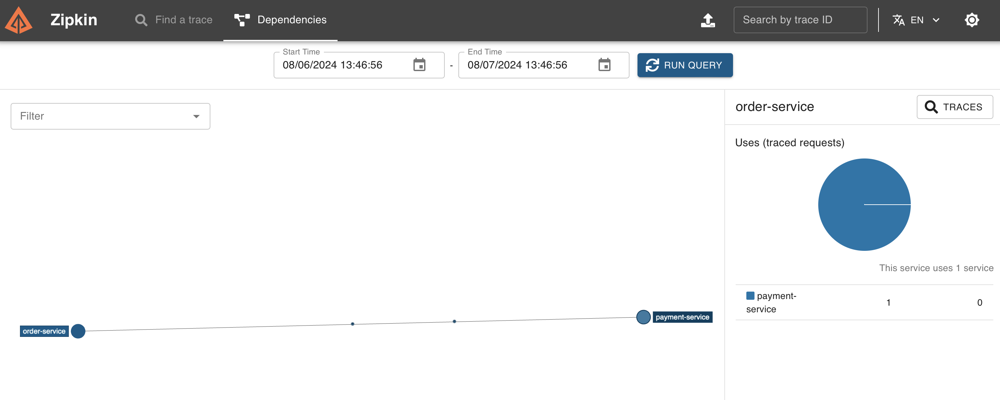

# MicroMeter Tracing 服务链路追踪

MicroMeter Tracing 是度量监控框架，它可以用于监控应用的性能指标。在 Spring Cloud 中，我们可以使用 MicroMeter Tracing 来监控服务的性能指标，比如请求的响应时间、请求的成功率等。并查看整个微服务系统的链路，方便排查问题。

MicroMeter Tracing 收集的数据可以通过 ZipKin 来可视化展示。

## 启动 ZipKin

向 compose 文件添加，

```yml
  zipkin:
    image: openzipkin/zipkin
    ports:
      - 9411:9411
```

只转发 9411 端口即可，然后启动 docker，访问 9411 端口即可。


## 配置 MicroMeter Tracing

根据[官方文档](https://docs.micrometer.io/tracing/reference/)，首先要引入依赖，

```groovy
implementation platform('io.micrometer:micrometer-tracing-bom:latest.release')
```

platform 的功能和 dependencyManagement 类似，可以统一管理依赖的版本。

```groovy
implementation 'io.micrometer:micrometer-tracing'
```

注意，Micrometer 本身是只是一个追踪框架，需要配合具体的实现来使用，比如 Brave，作为分布式追踪的实现，以及 Observer，作为性能监控的实现。

```groovy
implementation 'io.micrometer:micrometer-tracing-bridge-brave'
implementation 'io.micrometer:micrometer-observation'
```

然后需要一个 Reporter，把数据发送到 ZipKin，

```groovy
implementation 'io.zipkin.reporter2:zipkin-reporter-brave'
```

如果是用的 Spring Interface Client，默认有一个 WebClient 的追踪器，参见[文档](https://docs.spring.io/spring-framework/reference/integration/observability.html)。如果使用 OpenFeign，还要引入 OpenFeign 的追踪器，

```groovy
implementation 'io.github.openfeign:feign-micrometer:13.3'
```

这些应该引入到需要追踪的服务中。这里我们希望追踪所有服务，所以在 allprojects 中引入。

如果使用默认的 WebClient Builder，即不自定义 WebClient Builder，那么就不需要额外配置，因为默认的 WebClient Builder 已经集成了追踪器。

但是，因为我们之前更改了 WebClient Builder，所以需要手动添加追踪器，参考[文档](https://docs.spring.io/spring-boot/reference/actuator/metrics.html)

如果用 OpenFeign，不用做这一步。

```java
@Bean
@LoadBalanced
WebClient.Builder webClientBuilder(
    @Autowired ObservationWebClientCustomizer observationWebClientCustomizer
) {
    HttpAsyncClientBuilder clientBuilder = HttpAsyncClients.custom();
    clientBuilder.setDefaultRequestConfig(RequestConfig.custom().build());
    CloseableHttpAsyncClient client = clientBuilder.build();
    ClientHttpConnector connector = new HttpComponentsClientHttpConnector(client);
    WebClient.Builder builder = WebClient.builder();
    observationWebClientCustomizer.customize(builder);
    return builder.clientConnector(connector);
}
```

然后修改需要追踪的服务的配置，

```yml
management:
  zipkin:
    tracing:
      endpoint: http://localhost:9411/api/v2/spans
  tracing:
    sampling:
      probability: 1.0
```

这样，就可以在 ZipKin 中看到服务的链路了。启动两个服务后，可以看到健康检查的信息，


再任意发送一个请求，可以看到新的链路信息，


点击 Show 可以看到详细的链路信息，


使用上方的依赖，可以查看服务间的调用链路，拓扑关系等等。


