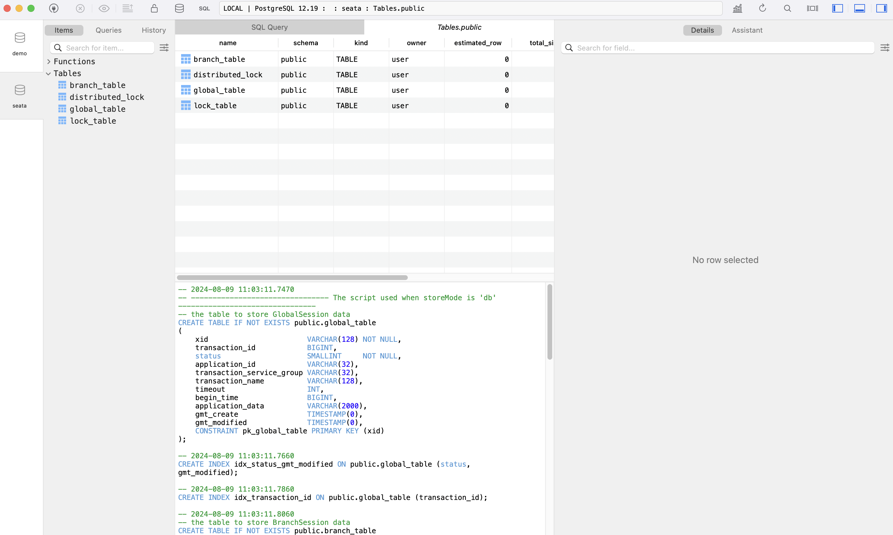
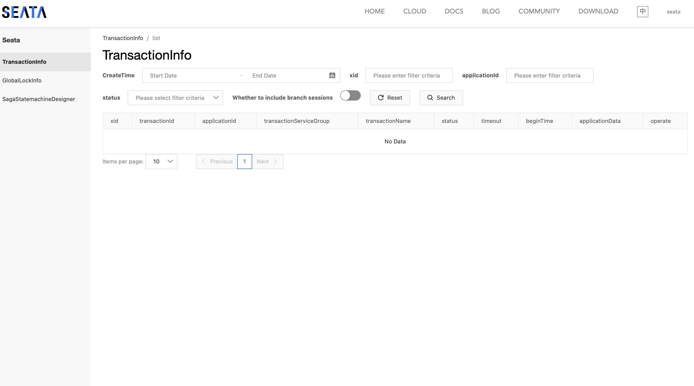
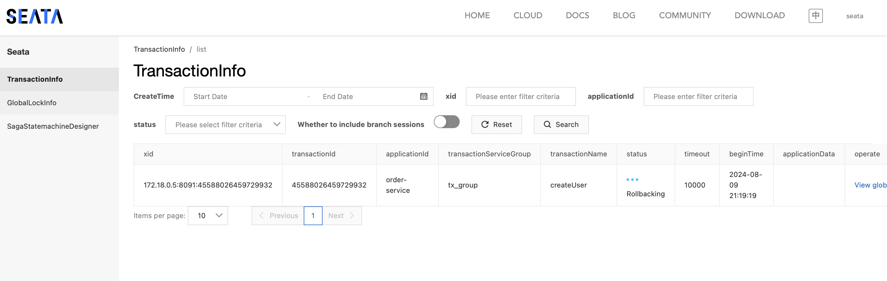

# 分布式事务 Seata

Seata 属于 Spring Cloud Alibaba 的组件，这里我们介绍它的原因是 Spring Cloud 官方并没有提供分布式事务的解决方案，而 Seata 是一个开源的分布式事务解决方案，它提供了 AT、TCC、SAGA、XA 四种分布式事务解决方案，其中 AT 模式是最常用的。我们只介绍 AT 模式。

## 事务

Spring 中，事务是指的是一组操作，要么全部成功，要么全部失败。在 Spring 中使用事务，我们可以使用 `@Transactional` 注解，它可以用在类上，也可以用在方法上，用在类上表示类中的所有方法都是事务性的，用在方法上表示该方法是事务性的。

```java
@Service
public class UserService {

    @Autowired
    private UserDao userDao;

    @Transactional
    public void add() {
        userDao.add();
        int i = 1 / 0;
    }
}
```

加上这个注解后，Spring 会在方法执行前开启一个事务，方法执行后，如果没有异常，会提交事务，如果有异常，会回滚事务。这里的回滚是通过 AOP 实现的，Spring 会在方法执行前后插入一些代码，这些代码就是事务的实现。

## 分布式事务

在分布式系统中，事务的问题会更加复杂，因为事务不再是在一个数据库中，而是在多个数据库中。在分布式系统中，我们需要保证事务的 ACID 特性，

- 原子性（Atomicity）：事务是一个不可分割的工作单位，要么全部成功，要么全部失败。但是在分布式系统中，事务可能会在多个数据库中，这就需要保证所有数据库的事务要么全部成功，要么全部失败。
- 一致性（Consistency）：事务执行前后，数据的完整性没有被破坏。但是在分布式系统中，数据可能会在多个数据库中，这就需要保证所有数据库的数据一致。
- 隔离性（Isolation）：事务之间是相互隔离的，一个事务的执行不会影响另一个事务的执行。但是在分布式系统中，事务可能会在多个数据库中，这就需要保证所有数据库的事务之间是隔离的。
- 持久性（Durability）：事务执行后，数据是持久化的。但是在分布式系统中，数据可能会在多个数据库中，这就需要保证所有数据库的数据是持久化的。

Seata 便是一个解决分布式事务的解决方案。

## Seata 的基本原理

Seata 有三大核心概念：

- TC（Transaction Coordinator）：事务协调器，负责事务的协调和全局事务的管理。即 Seata 本身。
- TM（Transaction Manager）：事务管理器，负责事务的开启、提交、回滚。即事务的发起者，它负责定义全局事务的范围，即要操作哪些数据库。一般是第一个被调的，带事务注解的方法。
- RM （Resource Manager）：资源管理器，负责管理分支事务的注册、状态汇报、回滚。即数据库本身。

每个 Seata 事务的生命周期如下：

1. TM 开启一个全局事务，生成一个 XID（全局事务 ID）。
2. XID 传递给 RM，RM 生成一个 Branch ID（分支事务 ID）。
3. RM 开启一个分支事务，执行业务逻辑。
4. RM 将 Branch ID 和 XID 传递给数据库，数据库将 Branch ID 和 XID 保存到数据库中。
5. TM 收到 RM 的返回，如果所有 RM 都返回成功，TM 提交事务，如果有一个 RM 返回失败，TM 回滚事务。

对于 AT 模式，具体而言，是通过锁和两次提交来实现的。

第一个阶段，业务数据和回滚日志在同一个本地事务中提交，在提交前后，会记录快照。第一阶段结束后，会生成行锁。第一个阶段是一个完整的本地事务。

第二个阶段，如果没有异常，只要删除第一阶段的锁、日志、快照即可。如果有异常，会通过第一阶段的日志和快照进行回滚。

## Seata 的配置

为了方便部署，这里依然使用 Docker。但注意，一般而言数据库不会放在 Docker 里。其它部署方式见[文档](https://seata.apache.org/docs/ops/deploy-guide-beginner)。

### 启动服务

首先，启动一个 Seata 服务：

```yml
seata-server:
    image: seataio/seata-server:2.0.0
    ports:
      - "7091:7091"
      - "8091:8091"
    depends_on:
      - postgres
      - consul
    volumes:
      - ./seata/application.yml:/seata-server/resources/application.yml
```

### 修改配置

`./seata/application.yml`的具体内容要根据你的配置而定，模版可以在容器内的`/seata-server/resources/application.example.yml`找到，或者在[GitHub](https://github.com/apache/incubator-seata/blob/develop/server/src/main/resources/application.example.yml)。

如果用 consul 和 postgres，配置如下：

```yml
seata:
  config:
    # support: nacos 、 consul 、 apollo 、 zk  、 etcd3
    type: consul
    consul:
      server-addr: consul:8500
      acl-token:
      key: seata.properties
  registry:
    # support: nacos 、 eureka 、 redis 、 zk  、 consul 、 etcd3 、 sofa
    type: consul
    consul:
      cluster: seata-server
      server-addr: consul:8500
      acl-token:
```

其它的配置都是通过 Consul 完成的。

注意，这里 register 的 cluster 是 Consul 的服务名，之后我们要要在客户端的配置文件中使用这个服务名。

### Server 服务注册与配置

如果使用服务中心方式，需要在服务中心进行配置。下文以 Consul 为例。

要把 Consul 作为 seata 注册地，启动 seata 前，将[这个配置文件](https://github.com/apache/incubator-seata/blob/1.4.2/script/config-center/config.txt)提交给 consul，否则会报错。

这里可以使用官方提供的[脚本](https://github.com/apache/incubator-seata/blob/1.4.2/script/config-center/consul/consul-config.sh)，进入容器内使用。注意，config.txt 文件要放在这个脚本的上级目录。这一步是将 Consul 作为注册中心需要的。

注意，因为我们用了 postgres，要修改这一部分配置。

```properties
store.db.datasource=druid
store.db.dbType=postgresql
store.db.driverClassName=org.postgresql.Driver
store.db.url=jdbc:postgresql://postgres:5432/seata
store.db.user=user
store.db.password=password
```

这些参数的含义参考这个[文档](https://seata.apache.org/zh-cn/docs/user/configurations)。

而将 Consul 作为配置中心，还要创建一个`seata.properties`文件，目前留空即可，因为前面的配置文件已经包含了所有配置。

### Client 事务分组与配置

我们讲解在配置文件中唯一重要的概念，事务分组。事务分组是指将一个 Seata 集群中不同服务器分成若干组，然后一些微服务会使用某个分组。

首先，我们需要在两个服务中引入 Seata Client 的依赖。

```groovy
implementation 'io.seata:seata-spring-boot-starter:2.0.0'
implementation 'io.seata:seata-all:2.0.0'
```

使用 Spring Boot 时，默认的配置文件如下，

```yml
seata:
  registry:
    type: consul
    consul:
      server-addr: 127.0.0.1:8500
  # 事务分组配置，1.4.2 默认名称为 my_test_tx_group ，1.5版本将改为 default_tx_group
  tx-service-group: my_test_tx_group
  service:
    # 事务分组与集群映射关系
    vgroup-mapping:
      my_test_tx_group: default
```

全部的配置可以见[这个文件](https://github.com/apache/incubator-seata/blob/develop/script/client/spring/application.yml)。

具体而言，对于一个微服务，它在寻找自己对应的 Seata 服务器时，会经过如下步骤（假设使用 boot 版本）：

1. Client 会先在配置文件的`seata.tx-service-group`中找到事务分组的名字。这个值默认是 my_test_tx_group。
2. Client 会在`seata.service.vgroupMapping.${seata.tx-service-group}`中找到这个分组对应的服务名。这个值记为分组名`group-name`。如果使用远程配置，这个值的 key 省略为`service.vgroup-mapping.${seata.tx-service-group}`。
3. Client 在`service.grouplist.${group-name}`找到这个分组的服务器地址。使用远程配置时，会用`${group-name}`作为服务名去找。

如果全用本地配置，应当这样（type 字段默认都是 file）：

```yml
seata:
  registry:
    consul:
      server-addr: localhost:8500
  tx-service-group: tx_group
  service:
    vgroup-mapping:
      tx_group: seata-group
    grouplist:
      seata-group: 127.0.0.1:8091
```

对于我们使用 consul，应该这样配置：

```yml
seata:
  config:
    type: consul
    consul:
      server-addr: localhost:8500
  registry:
    type: consul
    consul:
      server-addr: localhost:8500
  tx-service-group: tx_group
```

而 service 部分应当远程配置，即在 Consul 的 KV 中，我们之前的 config 只添加了默认的配置，现在要添加这些字段：

```properties
service.vgroup-mapping.tx_group=seata-server
```

这里 seata-server 是我们的服务名，即之前配置的`cluster`。

但是，注意，目前因为我们使用了 docker 配置，所以我这里获取的 seata 地址是`172.18.0.5:8091`，这是容器内的地址。在生产环境中，如果产品也是运行在 docker 环境中，只要设置 exposed 就可以了。但是现在我们的产品是运行在本地的，而 seata 运行在 docker 内，要么让 docker 网络和本地网络相连，要么把一整套迁移到本地。

因此为了避免麻烦，下面的演示使用 file 模式配置。

### 数据库配置

然后，Seata 需要一个单独的数据库，用于保存事务信息。这个文件可以从 Seata 官方[下载](https://github.com/apache/incubator-seata/tree/develop/script/server/db)，然后自行建立一个新的名为`seata`的数据库，导入这个文件。

创建之后，应该有这样的表：



之后，重新启动 Seata 服务，会有一些错误，但是最后会成功启动。Seata 需要一点时间从 Consul 读取信息。最后，命令行上会输出 web 界面的地址，访问这个地址，可以看到 Seata 的控制台。Consul 中也会有 Seata 服务的注册。

输入 application.yml 里的账号和密码后，可以看到这个界面：



## Seata 的使用

为了测试，我们人为构造一个没有意义的事务。现在创建两个数据表，每个数据表都有一个 id，第一个数据表有一个 name，第二个数据表有一个 age。我们要保证这两个表的数据要么同时插入，要么同时删除。

```sql
CREATE TABLE name (
    id SERIAL PRIMARY KEY,
    name TEXT
);
CREATE TABLE age (
    id SERIAL PRIMARY KEY,
    age INT
);
```

然后创建对应的 Repository 和 Record。因为我们要测试的场景是分布式事务，即若干微服务都操作数据库。

我们在之前的，作为 provider 的 payment 服务中，提供一个新的 API，这个 API 应当向 name 表插入数据。

```java
package io.github.fingerbone.entity;

import jakarta.persistence.Column;
import jakarta.persistence.Entity;
import jakarta.persistence.GeneratedValue;
import jakarta.persistence.GenerationType;
import lombok.AllArgsConstructor;
import lombok.Data;

@Entity
@Data
@AllArgsConstructor
public class Name {
    @Column
    @Id
    @GeneratedValue(strategy = GenerationType.IDENTITY)
    private Long id;

    @Column
    private String name;
}

package io.github.fingerbone.repository;

import org.springframework.data.jpa.repository.JpaRepository;
import org.springframework.stereotype.Repository;

import io.github.fingerbone.entity.Name;

@Repository
public interface NameRepository extends JpaRepository<Name, Long> {
    
}

package io.github.fingerbone.service;

import org.springframework.beans.factory.annotation.Autowired;
import org.springframework.stereotype.Service;

import io.github.fingerbone.entity.Name;
import io.github.fingerbone.repository.NameRepository;
import lombok.RequiredArgsConstructor;

@Service
@RequiredArgsConstructor
public class NameService {
    private final NameRepository nameRepository;

    public void createName(String name) {
        System.out.println("Will create name with name: " + name);
        nameRepository.save(
            new Name(null, name)
        );
    }
}

package io.github.fingerbone.controller;

import io.github.fingerbone.entity.Payment;
import io.github.fingerbone.record.PaymentRecord;
import io.github.fingerbone.service.NameService;
import io.github.fingerbone.service.PaymentService;
import io.github.fingerbone.wrapper.ResponseWrapper;
import lombok.RequiredArgsConstructor;

import org.springframework.beans.factory.annotation.Autowired;
import org.springframework.web.bind.annotation.GetMapping;
import org.springframework.web.bind.annotation.PostMapping;
import org.springframework.web.bind.annotation.RequestMapping;
import org.springframework.web.bind.annotation.RestController;
import org.springframework.web.bind.annotation.RequestBody;
import org.springframework.web.bind.annotation.PathVariable;
import org.springframework.web.bind.annotation.DeleteMapping;
import org.springframework.web.bind.annotation.PutMapping;

import java.util.stream.Collectors;
import java.util.List;

@RestController
@RequestMapping("/payment")
@RequiredArgsConstructor
public class PaymentController {
    private final NameService nameService;

    @PostMapping("/name")
    public void createName(@RequestParam String name) {
        nameService.createName(name);
    }
}
```

然后是 order 服务，这个服务应当向 age 表插入数据，然后请求 payment 服务插入 name 表数据。

```java
@HttpExchange("http://payment-service/payment")
public interface PaymentAPIIf {

    @PostExchange("/name")
    void createName(@RequestParam String name);
}

package io.github.fingerbone;

import jakarta.persistence.Column;
import jakarta.persistence.Entity;
import jakarta.persistence.GeneratedValue;
import jakarta.persistence.GenerationType;
import lombok.AllArgsConstructor;
import lombok.Data;

@Entity
@Data
@AllArgsConstructor
public class Age {
    @Id
    @Column
    @GeneratedValue(strategy = GenerationType.IDENTITY)
    private Long id;

    @Column
    private Short age;
}

package io.github.fingerbone;

import org.springframework.data.jpa.repository.JpaRepository;
import org.springframework.stereotype.Repository;

@Repository
public interface AgeRepository extends JpaRepository<Age, Long> {

    
}

package io.github.fingerbone;

import org.springframework.stereotype.Service;

import lombok.RequiredArgsConstructor;

@Service
@RequiredArgsConstructor
public class AgeService {
    private final AgeRepository ageRepository;
    private final PaymentAPIIf paymentAPIIf;

    public void create(String name, Short age) {
        System.out.println("Will create age with name: " + name + " and age: " + age);
        ageRepository.save(
            new Age(null, age)
        );
        System.out.println("Will create name with name: " + name);
        paymentAPIIf.createName(name);
    }
}

package io.github.fingerbone;


import io.github.fingerbone.api.PaymentApi;
import io.github.fingerbone.record.PaymentRecord;
import io.github.fingerbone.wrapper.ResponseCode;
import io.github.fingerbone.wrapper.ResponseWrapper;
import io.github.resilience4j.bulkhead.annotation.Bulkhead;
import io.github.resilience4j.circuitbreaker.annotation.CircuitBreaker;
import lombok.Data;
import lombok.RequiredArgsConstructor;

import org.springframework.beans.factory.annotation.Autowired;
import org.springframework.http.HttpEntity;
import org.springframework.http.ResponseEntity;
import org.springframework.web.bind.annotation.*;
import org.springframework.web.client.RestTemplate;
import org.springframework.core.ParameterizedTypeReference;
import org.springframework.http.HttpMethod;

import java.util.List;
import org.springframework.web.bind.annotation.PostMapping;
import org.springframework.web.bind.annotation.RequestBody;


@RestController
@RequestMapping("/if/payment")
@RequiredArgsConstructor
public class ConsumerPaymentController {
    private final AgeService ageService;
    @PostMapping("/age")
    public void createAge(@RequestParam String name, @RequestParam Short age) {
        ageService.create(name, age);
    }
}
```

现在，启动两个服务，进行测试，可以发现 name 表与 age 表可以被正确操作了。

现在，我们希望插入 name 和 age 作为同一个事务，即要么同时插入，要么同时删除。两个微服务的两个 Service 作为同一个事务进行处理。

参考 Seata 的[文档](https://seata.apache.org/docs/user/quickstart#step-2-create-undo_log-table)，在 AT 模式下，需要在需要事务操作的数据库中创建一个`undo_log`表。脚本在[这里](https://github.com/apache/incubator-seata/blob/2.x/script/client/at/db)。

要使用 Seata，只需要为 TM 方法加上`@GlobalTransactional`注解即可，即整个微服务调用链的发起方法。

```java
@GlobalTransactional(name = "createUser", timeoutMills = 10000, rollbackFor = Exception.class)
```

现在，如果在被调微服务中手动触发异常，可以发现，尽管命令行中输出了插入的相关信息，但数据库里并没有信息，说明触发了 Rollback，命令行上也有相关的输出。

在 Seata 的控制台上，也有相关记录。


