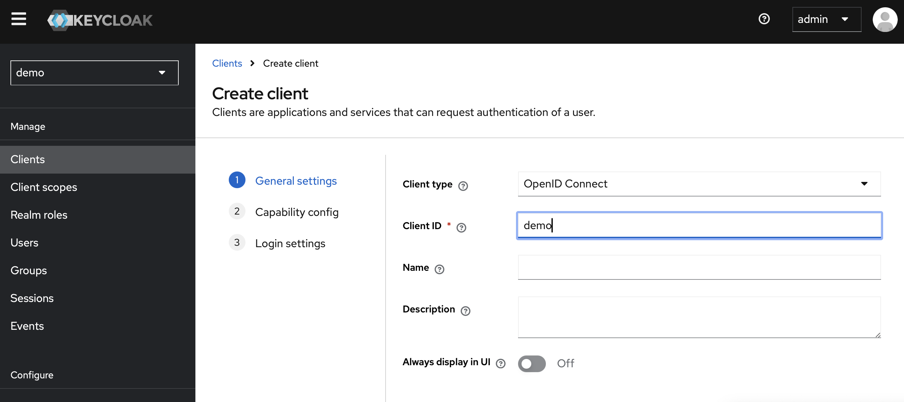
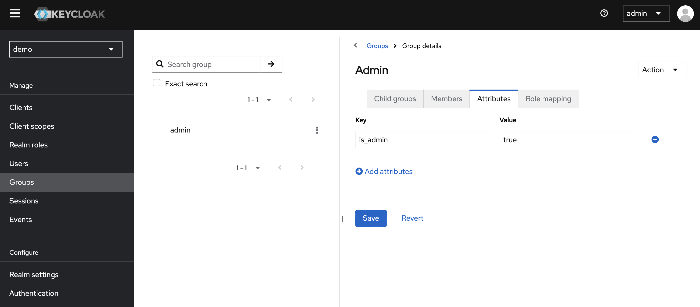

# Spring Security OAuth 认证与 KeyCloak

上次介绍了单体应用使用 Spring Security 的基本配置，这次讲解 OAuth2 框架的使用。

OAuth2 只是一套授权框架，不包含认证功能。Spring Security 为 OAuth2 提供了支持，可以很方便地实现 OAuth2 的认证与鉴权。其它语言也有 OAuth2 框架。例如，Python 有 `authlib`，Go 有 `golang.org/x/oauth2`。

这里我们使用 KeyCloak 作为授权服务器，KeyCloak 是一个开源的身份和访问管理解决方案。KeyCloak 为 OAuth2 和 OIDC 提供了支持。OIDC 是 OAuth2 的一个扩展，为 OAuth2 添加了用户信息的获取，并增强了安全性。

## OAuth2

OAuth2 是一个开放标准，允许用户授权第三方应用访问他们存储在另外的服务提供者上的信息，而不需要将用户名和密码提供给第三方应用。OAuth2 为用户资源的授权提供了一个安全的、开放和简单的标准。这个标准的文档在 [RFC 6749](https://datatracker.ietf.org/doc/html/rfc6749) 中。

简单来说，OAuth2 中有四个角色：

- 资源拥有者（Resource Owner）：用户
- 客户端（Client）：第三方应用
- 授权服务器（Authorization Server）：用于认证用户并授权客户端访问资源的服务器
- 资源服务器（Resource Server）：存储资源的服务器

当然，可以授权服务器和资源服务器可以是同一个服务器，这样就是一个单体应用。如果不在同一个服务器上，就是微服务架构。现在很多网站都提供了 OAuth2 的授权服务，例如 GitHub，Google。国内的 Gitee 也提供了 OAuth2 的授权服务。

OAuth2 中有四种授权方式：

- 授权码模式（Authorization Code）：具体流程为，客户端重定向到授权服务器，用户登录并授权，授权服务器重定向到客户端，并提供授权码，客户端使用授权码获取 Token，再使用 Token 获取资源。
- 简化模式（Implicit）：具体流程为，客户端重定向到授权服务器，用户登录并授权，授权服务器重定向到客户端，客户端直接获取 Token，再使用 Token 获取资源。
- 密码模式（Resource Owner Password Credentials）：适用于受信任的客户端。客户端直接使用用户名和密码获取 Token，再使用 Token 获取资源。
- 客户端模式（Client Credentials）：客户端直接使用客户端 ID 和客户端密码获取 Token，再使用 Token 获取资源。

注意，前三种模式都有客户端的参与，最后一种模式没有客户端的参与，即授权服务器签发一个固定的 secret，这个 secret 可以直接用来获取 token，因此是用于服务对服务的通信。而前三种都是客户端和用户的通信。

在 OAuth2 中，验证使用的 Token 通常是 JWT。不过 JWS，即 JSON Web Signature，也是一种常用的 Token 格式。

## OIDC

OIDC，即 OpenID Connect，是 OAuth2 的一个扩展。OIDC 为 OAuth2 添加了用户信息的获取。OIDC 为 OAuth2 添加了一个 ID Token，用于获取用户信息。OIDC 的文档在 [OIDC](https://openid.net/specs/openid-connect-core-1_0.html) 中。

OIDC 与 OAuth2 的主要区别有，

- OIDC 只使用授权码模式和客户端模式。
- OIDC 添加了用户信息的 scope，用于获取用户信息。
- OIDC 还能生产用户令牌，用于用户认证。

## Spring Security OAuth2 授权码模式登陆

首先我们介绍如何在 Spring Security 中配置 OAuth2 客户端。这里我们将会使用 GitHub 作为授权服务器。由于在后端开发中，几乎只会用到授权码模式，因此我们只介绍这一种模式。

首先，加入依赖，

```groovy
implementation 'org.springframework.boot:spring-boot-starter-oauth2-client'
```

然后删除其它认证方式，添加 OAuth2 登陆，

```java 
@Bean
public SecurityWebFilterChain securityWebFilterChain(
    ServerHttpSecurity http
) {
    SecurityWebFilterChain chain = http
    .httpBasic(basic -> basic.disable())
    .formLogin(form -> form.disable())
    .logout(logout -> logout.disable())
    .oauth2Login(Customizer.withDefaults())
    // .addFilterBefore(filter, SecurityWebFiltersOrder.AUTHENTICATION)
    .authorizeExchange(exchanges -> exchanges
            .pathMatchers("/resource/public").permitAll()
            .pathMatchers("/resource/private").authenticated()
            .pathMatchers("/resource/admin").hasRole("ADMIN")
            .anyExchange().permitAll()
    )
    .csrf(csrf -> csrf.disable())
    .cors(Customizer.withDefaults())
    .securityContextRepository(
        NoOpServerSecurityContextRepository.getInstance()
    )
    .build();
    return chain;
}
```

使用 GitHub 的授权服务器，需要向 GitHub 申请一个 OAuth2 应用，获取 Client ID 和 Client Secret。申请地址在[此处](https://github.com/settings/applications/new)，callback URL 必须填写`{baseUrl}/login/oauth2/code/{registrationId}`，现在即`http://localhost:8080/login/oauth2/code/github`。这个 URL 是授权服务器重定向到客户端的 URL，即接收授权码的 URL；homepage URL 填写`http://localhost:8080`，这个 URL 只是用于 homepage 检查，例如提供给 GitHub 查看是否属于 GitHub 认证的应用等。如果修改了端口要一并修改。

然后在 `application.yml` 中配置，

```yaml
spring:
  security:
    oauth2:
      client:
        registration:
          github:
            clientId: ${clientId}
            clientSecret: ${clientSecret}
```

之后再访问 `http://localhost:8080/resource/private`，会重定向到 GitHub 登陆页面。授权登陆后，会重定向到 `http://localhost:8080/login/oauth2/code/github`，然后再重定向到 `http://localhost:8080/resource/private`，并返回资源。

这样，我们就实现了 OAuth2 授权码模式的客户端。之前 URL 中的`code`也就代表了授权码模式。大部分的操作都已经被处理好了，不必我们过多关注。

## 创建 OIDC 授权服务器

授权服务器有许多选择，可以用 SaaS，例如 Auth0，也可以自己搭建。这里我们使用 KeyClock。其 Docker 镜像在[此处](https://hub.docker.com/r/keycloak/keycloak)。

```yaml
services:
  keyclock:
    image: keycloak/keycloak
    environment:
      - KEYCLOAK_ADMIN=admin
      - KEYCLOAK_ADMIN_PASSWORD=pwd
    ports:
      - 8080:8080
    command: start-dev
```

启动后，首先在左上角点击下拉框，创建一个 Realm，一个 Realm 即一个独立的授权服务器。然后在左侧选择 Clients，创建一个 Client，Client ID 即客户端 ID，Client Secret 即客户端密码。然后在左侧选择 Users，创建一个用户，用户名和密码即为用户的用户名和密码。


然后在左侧 clients 里创建一个新的 Client。



名字任意，其它信息默认即可。

然后，将 Access Settings 中 Root URL 设置好。目前可以随意设置，但是之后的 Callback URL 必须与这个 Root URL 有一样的根域名。

然后在左侧 Users 里创建一个新的用户。再点进新创建的用户，选择 Credential 界面，设置一个密码。

再进入左侧 Realm Settings，在最下方找到 Endpoint，点进去后会看到一个 json 对象，像下面这样，

```json
{"issuer":"http://localhost:8080/realms/demo","authorization_endpoint":"http://localhost:8080/realms/demo/protocol/openid-connect/auth","token_endpoint":"http://localhost:8080/realms/demo/protocol/openid-connect/token","introspection_endpoint":"http://localhost:8080/realms/demo/protocol/openid-connect/token/introspect","userinfo_endpoint":"http://localhost:8080/realms/demo/protocol/openid-connect/userinfo","end_session_endpoint":"http://localhost:8080/realms/demo/protocol/openid-connect/logout","frontchannel_logout_session_supported":true,"frontchannel_logout_supported":true,"jwks_uri":"http://localhost:8080/realms/demo/protocol/openid-connect/certs","check_session_iframe": ...}
```

这里的`authorization_endpoint`就是授权服务器的地址，`token_endpoint`就是获取 Token 的地址。下面我们会用到的相关信息都可以在这里找到。

现在，我们就已经可以用上面介绍的方式请求授权服务器了。上面的 Json 中已经给出了授权服务器的地址，和 token 的获取地址。

要添加或删除用户等操作，可以通过调用 KeyClock 的 REST API 来实现，这里不再赘述。

## 使用 OIDC 授权服务器

现在在 Spring 项目中，只需要将之前的 Client 换掉即可。在 `application.yml` 中配置，

```yaml
spring:
  security:
    oauth2:
      client:
        registration:
          keycloak:
            clientId: ${clientId}
            clientSecret: ${clientSecret}
            clientName: keycloak
            provider: keycloak
            redirectUri: "{baseUrl}/login/oauth2/code/{registrationId}"
            authorizationGrantType: authorization_code
            scope: openid
        provider:
          keycloak:
            authorizationUri: http://localhost:8080/realms/demo/protocol/openid-connect/auth
            tokenUri: http://localhost:8080/realms/demo/protocol/openid-connect/token
            jwkSetUri: http://localhost:8080/realms/demo/protocol/openid-connect/certs
            userInfoUri: http://localhost:8080/realms/demo/protocol/openid-connect/userinfo
            userNameAttribute: preferred_username
```

注意，这里的`client`字段之前已经介绍过。这里的`provider`是提供用户信息的地址，`jwkSetUri`是提供 JWT 的地址，`userInfoUri`是提供用户信息的地址，`userNameAttribute`是用户信息中的用户名字段。这些字段都可以在上面的 Endpoint 中找到。此外，尽管我们的 scope 是用的默认的，但不能省略，否则会报错。

目前，我们还没给用户提供多余的信息。现在在 KeyCloak 的 Client Scope 里，创建一个新的 Scope，打开 include in token scope。这样会在认证时就可以同时在 JWT 里返回这条信息。


然后，为它创建一个 Mapper，这里我们选择 User Attribute。这里我们所有的 key 统一用 `is_admin`。这样，JWT 中`is_admin`的值会被映射到用户的`is_admin`属性。这里的逻辑是，JWT 中 Claim 名为 Token Claim Name 的会被映射到用户的 User Attribute Name。


要给用户设定 Attribute，需要把用户加入组中，然后在组里设置 Scope 的值。这样用户就会有这个 Scope 的值了。



然后在 Members 里，把 admin 加进去。


最后，在 Client 里，将这个 Scope 加进去。


这里如果设置的 Default，请求时就会自动加上这个 Scope。如果设置的 Optional，请求时会根据 Scope 参数来决定是否加上这个 Scope。

现在进入到 Client Scope 的 Evaluate 界面，可以看到 token 里已经能正确返回`is_admin`了。


现在，修改一下 FilterChain 即可。Spring Security 自动把 Authorities 设置为`SCOPE_{name}`，这样可以通过判断某个 Scope 是否存在来判断用户是否有权限。

```java
@Configuration
@EnableWebFluxSecurity
public class SecurityConfig {
    @Bean
    SecurityWebFilterChain springSecurityFilterChain(ServerHttpSecurity http) {
        http
            .oauth2Login(Customizer.withDefaults())
            .authorizeExchange(exchanges -> exchanges
                .pathMatchers("/resource/public").permitAll()
                .pathMatchers("/resource/private").authenticated()
                .pathMatchers("/resource/admin").hasAnyAuthority("SCOPE_is_admin")
                .anyExchange().permitAll()
            );
        return http.build();
    }
}
```

现在，就能通过`/resource/admin`来访问需要`is_admin` Scope 的资源了。
