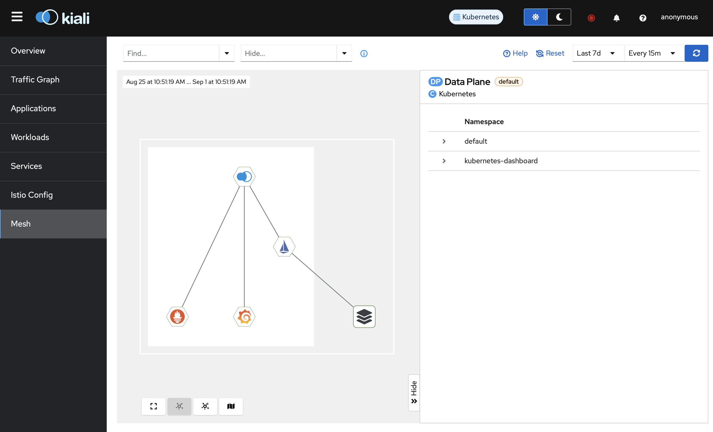

# 服务网格

服务网格（Service Mesh）是一种基础设施层，用于处理服务之间的通信。它提供了一种透明的方式，使得服务之间的通信更加可靠、安全、高效。服务网格的目标是解耦服务的开发和运维，使得服务的开发者可以专注于业务逻辑，而运维者可以专注于服务的可观察性、安全性、性能等方面。

服务网格就类似于现实中的路网，其中有道路和一些必要建筑（如红绿灯、收费站等）。道路是服务之间的通信，而建筑是服务网格的功能。现在，作为城市的设计者，我们只需要在空格里放置一些建筑，就能建造出一个城市。同样的，作为软件开发者，我们只需要在服务网格中放置一些功能，就能构建出一个微服务系统。

服务网格又称为微服务基础设施，它是微服务架构的一部分。服务网格通常由两部分组成：数据平面（Data Plane）和控制平面（Control Plane）。数据平面负责服务之间的通信，控制平面负责配置、监控、管理数据平面。

服务网格本身也是一个微服务，它由一些微服务组成，这些微服务负责服务网格的各个功能。因此，部署它们是很复杂的。不过，前面我们介绍过 helm，helm 可以一次部署一整个 k8s 集群，因此也可以一次部署一个服务网格。

服务网格的具体使用根据提供商有些许不同。这里我们使用 istio 作为服务网格，它是一个开源的服务网格，由 Google、IBM 和 Lyft 共同开发。istio 提供了一些功能，如流量管理、安全、监控等。

前面我们在介绍网关时已经使用了 istio 的网关，当时在安装时我们事实上已经安装了 istio 服务网格的一部分。这一章我们系统地介绍一下 istio 的服务网格。

## 服务网格的结构与原理

通过前面的学习，我们可以看到，微服务需要许多功能，而 k8s 和 Spring Cloud 区别是，前者是非侵入的，代码中感知不到 k8s 的存在，而后者是侵入的，代码中需要使用 Spring Cloud 的 API。

服务网格提供了微服务的大部分功能，不再需要自己搭建，其中主要有，

- 安全认证和鉴权
- 负载均衡
- 流量管理
- 访问控制
- 链路追踪

这涵盖了之前使用 Spring Cloud 讲到的大部分功能。微服务的其它功能，服务注册、配置与管理由 k8s 提供，分布式事务仍然需要额外的组件。

服务网格的这些功能通过代理实现。服务网格中的每个微服务都有一个代理，拦截所有的网络流浪，并负责服务之间的通信。这个代理是透明的，微服务不需要关心这个代理的存在。这个代理负责负载均衡、故障恢复、流量管理等。

代理可分为两种，L4 代理和 L7 代理，分别对应 OSI 模型的第四层和第七层。L4 代理功能比较少，但性能好，L7 代理功能多，但性能差。

服务网格可以在逻辑上分成两个平面，

- 数据平面是一系列的网络代理，用来协调和监控微服务之间的通信。这些代理是部署在每个微服务之间的，它们负责服务之间的通信、负载均衡、故障恢复等。这些代理是透明的，微服务不需要关心这些代理的存在。
- 控制平面是一系列的微服务，用来管理数据平面。

istio 的数据平面有两种工作模式，sidecar 和 ambient。sidecar 即侧载，是将代理部署在每个微服务的 Pod 中，这是 istio 的默认工作模式。ambient 即环境，是将代理部署在 Pod 的环境中，这是 istio 的另一种工作模式。

sidecar 模式默认使用 L7 代理，而为了性能，ambient 模式使用 L4 代理，但是可以手动把一部分代理切换到 L7 代理，来补全一些功能，例如链路追踪。

ambient 模式比较新，且性能好，但缺少一部分的功能。这里我们讲解 ambient 模式。

## Ambient 模式安装

可以直接通过`istioctl install --set profile=ambient`来安装 istio，并安装好 Gaetway API，使用，

```bash
kubectl get crd gateways.gateway.networking.k8s.io &> /dev/null || \
  { kubectl apply -f https://github.com/kubernetes-sigs/gateway-api/releases/download/v1.1.0/standard-install.yaml; }
```

但是为了方便升级与维护，推荐使用 helm。

我们先启动一个新的集群，然后向 helm 添加一个 repo，

```bash
helm repo add istio https://istio-release.storage.googleapis.com/charts
```

使用`helm repo update`来获取 Chart。

然后我们安装组件即可。与使用`istioctl`不同，helm 可以分组件安装，

注意，要先安装网关的 CRD，然后再安装以下内容。

基础组件，这里的`-n`是指定命名空间，`--create-namespace`是创建命名空间，`--wait`是等待安装完成。

```bash
helm install istio-base istio/base -n istio-system --create-namespace --wait
```

CNI 组件，它负责检测属于 Ambient 网格的 Pod，并配置 Pod 和 ztunnel 节点代理（稍后将安装）之间的流量重定向。

```bash
helm install istio-cni istio/cni -n istio-system --set profile=ambient --wait
```

控制平面，

```bash
helm install istiod istio/istiod --namespace istio-system --set profile=ambient --wait
```

ZTunnel 代理，

```bash
helm install ztunnel istio/ztunnel -n istio-system --wait
```

## Ambient 应用部署

这里我们就不自己实现了，使用 istio 的示例应用 BookInfo，由四套不同语言实现的微服务组成。

使用 kubectl 部署，当然也可以打包成 Chart，这里为了方便就不打包了。

```bash
kubectl apply -f https://raw.githubusercontent.com/istio/istio/release-1.23/samples/bookinfo/platform/kube/bookinfo.yaml
kubectl apply -f https://raw.githubusercontent.com/istio/istio/release-1.23/samples/bookinfo/platform/kube/bookinfo-versions.yaml
```

然后配置网关，

```bash
kubectl apply -f https://raw.githubusercontent.com/istio/istio/release-1.23/samples/bookinfo/gateway-api/bookinfo-gateway.yaml
```

现在，我们可以同以往一样访问网关的服务，而网关会将请求转发到对应的服务上。这些微服务并没有什么特殊性，也不需要额外操作。

然后我们就像之前一样访问网关，打开 minikube tunnel，访问`http://localhost/productpage`，就能看到页面。


## 应用监控

我们仍然需要安装 Prometheus 和 Grafana 来监控应用，以及使用 Kiali Dashboard。

```bash
kubectl apply -f https://raw.githubusercontent.com/istio/istio/release-1.23/samples/addons/prometheus.yaml
kubectl apply -f https://raw.githubusercontent.com/istio/istio/release-1.23/samples/addons/grafana.yaml
kubectl apply -f https://raw.githubusercontent.com/istio/istio/release-1.23/samples/addons/kiali.yaml
```

然后使用`istioctl dashboard kiali`来打开 Kiali Dashboard。

然后我们发送一些请求，

```bash
for i in $(seq 1 100); do curl -s http://localhost:8080/productpage; done
```

然后我们能在 Kiali Dashboard 上看到请求的流量。


但是，我们会发现一个问题：只有`productpage`服务有流量。这是因为，我们的微服务没有在数据平面注册，因此 istio 无法监控到这些服务。

我们可以直接把一整个 namespace 加入到 istio 的数据平面中，

```bash
kubectl label namespace default istio.io/dataplane-mode=ambient
```

现在，我们就能看到所有的服务了。


我们也可以在 Mesh 页面查看我们的服务网格。



## L4 鉴权

注意，这里的鉴权是以 Pod 为单位的，而不是用户。

下面的用户创建等过程在示例中已经有了，不需要我们操作，这里仅进行介绍。

鉴权是基于 ServiceAccount 的，

```yaml
apiVersion: v1
kind: ServiceAccount
metadata:
  name: bookinfo-productpage
  labels:
    account: productpage
```

要把 ServiceAccount 与 Pod 绑在一起。

```yaml
apiVersion: apps/v1
kind: Deployment
metadata:
  name: productpage-v1
  labels:
    app: productpage
    version: v1
spec:
  # ...
  template:
    metadata:
      # ...
    spec:
      serviceAccountName: bookinfo-productpage
      # ...
```

然后创建 AuthorizationPolicy，

```yaml
apiVersion: security.istio.io/v1
kind: AuthorizationPolicy
metadata:
  name: productpage-viewer
  namespace: default
spec:
  selector:
    matchLabels:
      app: productpage
  action: ALLOW
  rules:
  - from:
    - source:
        principals:
        - cluster.local/ns/default/sa/bookinfo-gateway-istio
```

这里的 principal 是允许访问的 ServiceAccount。`bookinfo-gateway-istio`是 istio 默认的网关服务账户。principals 的格式是，

```txt
{cluster-name}/ns/{namespace}/sa/{service-account}
```

cluster-name 是集群的名字，默认是`cluster.local`。ns 代表 namespace，namespace 填入 ServiceAccount 所在的 namespace。sa 代表 ServiceAccount，最后加上 ServiceAccount 的名字。

现在，只允许`bookinfo-gateway-istio`访问`productpage`服务，即必须通过网关。我们可以随意进入一个 Pod，运行`curl -s "http://productpage:9080/productpage"`，会发现无法访问。

## L7 鉴权

前面的 L4 鉴权只能在 OSI 第四层，即传输层，TCP/UDP 协议。而 L7 鉴权可以在 OSI 第七层，即应用层，HTTP 协议。这样就可以约束更多的内容，例如请求头、请求体等，因此可以支持 OAuth2，JWT 等等。

要在 Ambient 模式打开 L7 鉴权，需要把默认的 L4 Envoy 代理替换为 L7 Waypoint 代理。只要创建`waypoint`对象，`waypoint`是特殊的 Gateway。这个 waypoint 会代理所有通过当前 namespace 的流量。

```yaml
apiVersion: gateway.networking.k8s.io/v1
kind: Gateway
metadata:
  labels:
    istio.io/waypoint-for: service
  name: waypoint
spec:
  gatewayClassName: istio-waypoint
  listeners:
  - name: mesh
    port: 15008
    protocol: HBONE
```

这里的 listeners 我们不需要关心。在这个 listener 上，可以在 L4 基础上建立 L7 代理。

然后我们修改 Policy，

```yaml
apiVersion: security.istio.io/v1
kind: AuthorizationPolicy
metadata:
  name: productpage-viewer
  namespace: default
spec:
  targetRefs:
  - kind: Service
    group: ""
    name: productpage
  action: ALLOW
  rules:
  - from:
    - source:
        principals:
        - cluster.local/ns/default/sa/sleep
    to:
    - operation:
        methods: ["GET"]
```

这里我们约束了只允许访问`productpage`服务的 GET 方法。如果使用，

```bash
kubectl exec deploy/reviews-v1 -- curl -s http://productpage:9080/productpage
```

可以看到，access denied。

如果希望使用，例如，JWT 鉴权，可以使用`RequestAuthentication`对象，

```yaml
apiVersion: security.istio.io/v1
kind: RequestAuthentication
metadata:
  name: "jwt-example"
  namespace: foo
spec:
  selector:
    matchLabels:
      app: httpbin
  jwtRules:
  - issuer: "testing@secure.istio.io"
    jwksUri: "https://raw.githubusercontent.com/istio/istio/release-1.23/security/tools/jwt/samples/jwks.json"
```

然后把之前的 principal 改成请求 principal。

```yaml
apiVersion: security.istio.io/v1
kind: AuthorizationPolicy
metadata:
  name: require-jwt
  namespace: foo
spec:
  selector:
    matchLabels:
      app: httpbin
  action: ALLOW
  rules:
  - from:
    - source:
       requestPrincipals: ["testing@secure.istio.io/testing@secure.istio.io"]
```

这里我们就不再详细介绍了。

## 流量管理

我们可以在 HTTPRoute 中配置流量管理，例如，

```yaml
apiVersion: gateway.networking.k8s.io/v1
kind: HTTPRoute
metadata:
  name: reviews
spec:
  parentRefs:
  - group: ""
    kind: Service
    name: reviews
    port: 9080
  rules:
  - backendRefs:
    - name: reviews-v1
      port: 9080
      weight: 90
    - name: reviews-v2
      port: 9080
      weight: 10
```

这样就可以使得 90% 的流量访问 reviews-v1，10% 的流量访问 reviews-v2。

## 熔断

可以通过`DestinationRule`来配置熔断，

```yaml
apiVersion: networking.istio.io/v1
kind: DestinationRule
metadata:
  name: httpbin
spec:
  host: httpbin
  trafficPolicy:
    connectionPool:
      tcp:
        maxConnections: 1
      http:
        http1MaxPendingRequests: 1
        maxRequestsPerConnection: 1
    outlierDetection:
      consecutive5xxErrors: 1
      interval: 1s
      baseEjectionTime: 3m
      maxEjectionPercent: 100
```

这里的参数参考[文档](https://istio.io/latest/docs/tasks/traffic-management/circuit-breaking/)即可。

## 限流

限流只要修改 HTTPRoute，

```yaml
apiVersion: gateway.networking.k8s.io/v1
kind: HTTPRoute
metadata:
  name: reviews
spec:
  parentRefs:
  - group: ""
    kind: Service
    name: reviews
    port: 9080
  rules:
  - backendRefs:
    - name: reviews-v2
      port: 9080
    timeouts:
      request: 500ms
```

## 总结

目前为止，我们对 k8s 本身的介绍已经结束，我们已经介绍了 k8s 的基本概念，如何用 k8s 部署应用，如何用 helm 管理应用，以及如何用服务网格。

由此，本系列也就结束了。希望读者能够通过这个系列了解到 Spring Cloud，k8s 等微服务技术。
