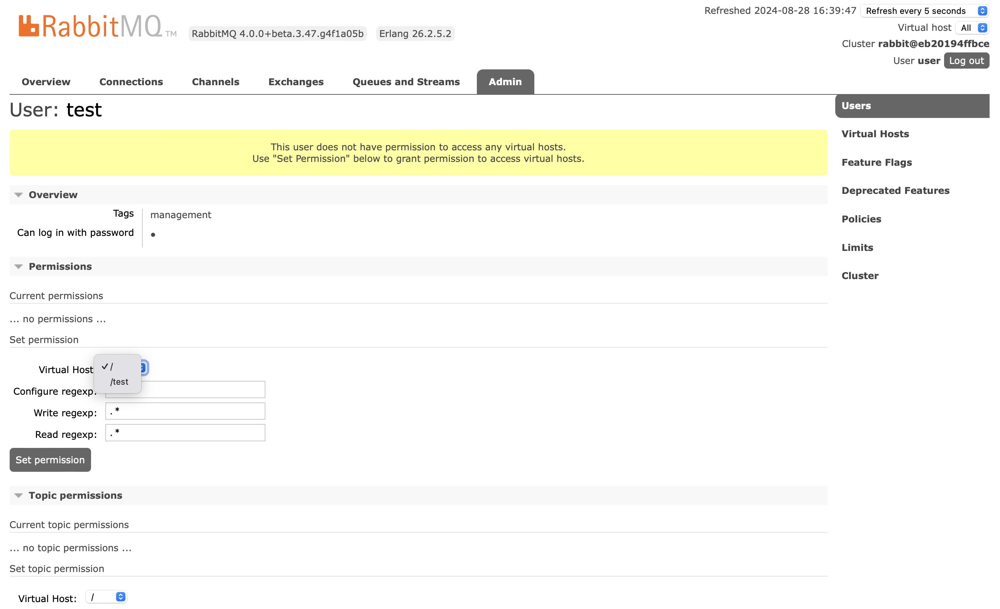
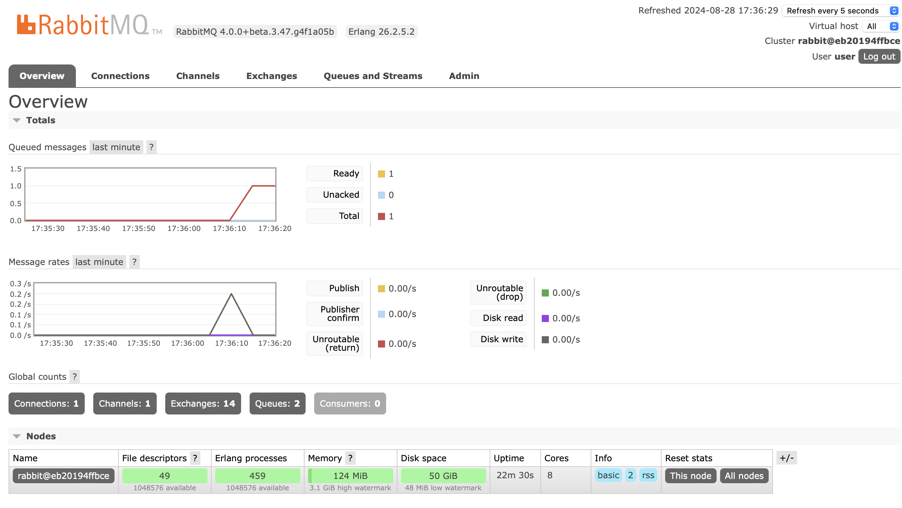

# 微服务速成 Ch16 Rabbit MQ

从这章起，我们的标题褪去 Spring，变成了微服务速成。目前我们依然基于 Spring 框架，但也只是众多选择之一。

Rabbit MQ 是一个 AMQP 的消息队列，它是一个开源的消息队列，可以用于构建分布式系统。Rabbit MQ 是一个消息中间件，它是一个独立的服务，用于存储消息，然后消费者消费消息。

之所以我们要引入消息队列，主要是为了解耦。在微服务架构中，服务之间的调用是通过 HTTP 完成的，这样就会有一个问题，就是服务之间的调用是同步的。如果一个服务挂了，那么调用者就会等待，这样就会导致整个服务都挂掉。而消息队列就是为了解决这个问题的，它是异步的，即生产者生产消息后就不管了，消费者消费消息，这样就解耦了。此外，消息队列还有销峰的功能，即在高峰期，消息队列可以缓存消息，然后在低峰期消费，这样增强了系统的稳定性。当然，引入新的中间件肯定会增加复杂度和不稳定性，因此要权衡。

相比其它的消息队列，Rabbit MQ 有一个优点，就是它是 AMQP 的实现。AMQP 是一个消息队列的标准，它规定了消息队列的格式，这样就可以保证不同消息队列之间的兼容性。因此，Rabbit MQ 可以和其它的消息队列兼容。Rabbit MQ 也有其它的优点，例如，它支持集群，支持持久化，支持事务，支持插件等。这些丰富的特性使得它常用于微服务架构中。

注意，到了这一章开始 Java 语言和 Spring 框架的重要性会逐渐淡化。尽管现在我们还是以 Spring 框架为基础讲 Rabbit MQ，但 Rabbit MQ 其实兼容很多语言和框架。之后的技术，例如 graphQL 和 gRPC，也是如此。而在最后一部分 k8s 中，为了开发效率，我们将会转向其它语言和框架。此外，前面学习的 Consul 也是这样。

## 基本概念

消息队列中，经常讨论以下几个概念，

- 生产者（Producer）：生产消息的服务，类似于之前响应式编程中的 Publisher
- 消费者（Consumer）：消费消息的服务，类似于之前响应式编程中的 Subscriber
- 队列（Queue）：存储消息的地方，生产者生产消息到队列，消费者消费消息
- AMQP：Advanced Message Queuing Protocol，消息队列的协议，Rabbit MQ 就是 AMQP 的实现
- 通道（channel）：生产者和消费者之间的通道，生产者通过通道发送消息到队列，消费者通过通道消费消息
- 交换机（Exchange）：转发消息的地方，生产者发送消息到交换机，交换机将消息发送到队列

## Rabbit MQ 六大模型

Rabbit MQ 提供了六种常见的消息队列与产销者的组织方式，包括，

- 缓冲队列（Buffer）：单个生产者，单个消费者。生产者的消息发送到队列，消费者从队列中消费消息。这时，消息队列只起到缓冲请求的作用。
- 工作队列（Work Queue）：单个生产者，多个消费者。生产者的消息发送到队列，多个消费者从队列中消费消息。这时，消息队列起到了负载均衡的作用。
- 扇出交换机（Fanout Exchange）：单个生产者，多个队列，多个消费者。生产者的消息发送到交换机，交换机将消息发送到所有的队列，每个队列有一个消费者。这时，消息队列起到了广播的作用。
- 路由交换机（Direct Exchange）：与扇出交换机类似，但是，消息会附带一个 routing key，交换机会根据 routing key 将消息发送到对应的队列。这时，消息队列起到了路由的作用。
- 主题交换机（Topic Exchange）：与路由交换机类似，但是，routing key 是一个通配符，交换机会根据通配符将消息发送到对应的队列。这时，消息队列依然是路由的作用。
- 远程过程调用（RPC）：生产者发送消息到队列，消费者消费消息后，再发送消息到另一个队列，生产者再消费消息。这时，消息队列起到了 RPC 的作用。

其中，扇出交换机，路由交换机与主题交换机统称为订阅发布模式（Publish/Subscribe），它们是消息队列中最常见的模式。

## 项目配置

依然使用 docker 来启动 Rabbit MQ，

```yaml
services:
  rabbitmq:
    image: rabbitmq:4.0-rc-management
    environment:
      - RABBITMQ_DEFAULT_USER=user
      - RABBITMQ_DEFAULT_PASS=password
    ports:
      - 15672:15672
      - 5672:5672
```

`15672`是管理的 WebUI，`5672`是 AMQP 的端口。

下文中，你可以直接使用 admin 账户，但是为了安全，最好还是创建一个新的账户。

## Rabbit MQ 管理界面

Rabbit MQ 管理界面可以进行消息的查看，队列的查看，用户的管理等。在浏览器中输入 `http://localhost:15672`，输入账户密码，即可进入管理界面。创建用户很简单，输入用户名，密码和权限即可。


注意，只有 Admin 或者 Management 权限的用户才能进入管理界面。

此外，Rabbit MQ 有一个功能，叫 Virtual Host，这是用来隔离不同的服务的，可以类比于数据库中，先分库，再分表。在 Rabbit MQ 中，先分 Virtual Host，再分 Queue。Virtual Host 是一个逻辑概念，它是一个独立的空间，不同的 Virtual Host 之间是隔离的。在 Rabbit MQ 管理界面中，可以创建 Virtual Host。


然后，点击用户管理界面的用户名，进入用户详情，使用 Set Permission 来设置用户能够访问的 Virtual Host。



## 缓冲队列模式

现在，我们使用 Spring AMQP 来实现一个缓冲队列模式。首先，添加依赖，

```groovy
implementation 'org.springframework.amqp:spring-rabbit:3.1.7'
```

如果是直接使用 Rabbit MQ，可以用下文的代码，

```java
ConnectionFactory connectionFactory = new CachingConnectionFactory();
AmqpAdmin admin = new RabbitAdmin(connectionFactory);
admin.declareQueue(new Queue("myqueue"));
AmqpTemplate template = new RabbitTemplate(connectionFactory);
template.convertAndSend("myqueue", "foo");
String foo = (String) template.receiveAndConvert("myqueue");
```

但是，肯定是使用 Spring Bean 才更合理。

```java
package io.github.fingerbone;

import org.springframework.amqp.core.AmqpAdmin;
import org.springframework.amqp.core.AmqpTemplate;
import org.springframework.amqp.core.Queue;
import org.springframework.amqp.rabbit.connection.CachingConnectionFactory;
import org.springframework.amqp.rabbit.connection.ConnectionFactory;
import org.springframework.amqp.rabbit.core.RabbitAdmin;
import org.springframework.amqp.rabbit.core.RabbitTemplate;
import org.springframework.context.annotation.Bean;
import org.springframework.context.annotation.Configuration;

@Configuration
public class RabbitConfig {

    @Bean
    public ConnectionFactory connectionFactory() {
        var factory = new CachingConnectionFactory();
        factory.setHost("localhost");
        factory.setUsername("user");
        factory.setPassword("password");
        factory.setVirtualHost("/");
        return factory;
    }

    @Bean
    public AmqpAdmin amqpAdmin() {
        return new RabbitAdmin(connectionFactory());
    }

    @Bean
    public AmqpTemplate amqpTemplate() {
        return new RabbitTemplate(connectionFactory());
    }

    @Bean
    public Queue foodQueue() {
        return new Queue("food");
    }
}
```

如果你需要创建多个 Queue，使用我们之前讲依赖注入的相关知识即可。

```java
@Bean("queue1")
public Queue queue1() {
    return new Queue("queue1");
}

@Bean("queue2")
public Queue queue2() {
    return new Queue("queue2");
}
```

然后我们添加一个生产者，

```java
@RestController
@RequiredArgsConstructor
public class ProducerController {

    private final RabbitTemplate rabbitTemplate;

    @GetMapping("/apple")
    public Mono<Void> apple() {
        rabbitTemplate.convertAndSend("food", "apple");
        return Mono.empty();
    }
    
}
```

调用后，可以发现消息已经发送到了队列中。




然后我们添加一个消费者，使用 `@RabbitListener` 注解，来监听队列。

```java
@Component
@RequiredArgsConstructor
public class Consumer {

    @RabbitListener(queues = "food")
    @RabbitHandler
    public void consume(String message) {
        System.out.println("Yummy! I ate " + message);
    }

}
```

`@RabbitListener`注解用来监听队列，`queues`参数用来指定队列名，`@RabbitHandler`注解用来指定处理方法。如果加`@RabbitListener`到类上，它会作用在所有方法上。此时，如果有多个消费者，那么消息默认会被平均分配到每个消费者。消费者处理了消息后，消息就会从队列中删除。

Rabbit MQ 是完美转发的，如果你之前传递一个别的对象，那么这里也会接收到这个对象。例如，你传递了一个 `Apple` 对象，那么这里也会接收到这个对象，不过你需要把参数改成对应的类型。

如果你的生产者和消费者使用不同的语言，那么你需要使用序列化和反序列化。Rabbit MQ 默认使用的是 Java 的序列化和反序列化，但是这种方式不够通用，因此，你需要使用 JSON 或者 Protobuf 等方式。使用 MessageConverter 来指定序列化和反序列化的方式。

```java
@Bean
public MessageConverter messageConverter() {
    return new Jackson2JsonMessageConverter();
}
```

然后，你需要在 RabbitTemplate 中指定 MessageConverter，

```java
@Bean
public AmqpTemplate amqpTemplate() {
    var template = new RabbitTemplate(connectionFactory());
    template.setMessageConverter(messageConverter());
    return template;
}
```

## 工作队列模式

工作队列模式是多个消费者消费同一个队列的消息。这时，消息队列起到了负载均衡的作用。在 Rabbit MQ 中，可以设置消费者的数量，这样就可以实现负载均衡。

```java
@Bean
public SimpleRabbitListenerContainerFactory rabbitListenerContainerFactory() {
    var factory = new SimpleRabbitListenerContainerFactory();
    factory.setConnectionFactory(connectionFactory());
    factory.setConcurrentConsumers(3);
    factory.setMaxConcurrentConsumers(10);
    return factory;
}
```

`SimpleRabbitListenerContainerFactory` 是用来设置消费者的数量的，`setConcurrentConsumers` 是设置初始消费者的数量，`setMaxConcurrentConsumers` 是设置最大消费者的数量。

如果你使用的微服务架构，那么你可以使用 Kubernetes 来自动扩容消费者的数量。如果是 Spring Cloud，那么你可以使用 Spring Cloud Stream 来自动扩容消费者的数量。

## 扇出交换机模式

扇出交换机模式是一个生产者发送消息到一个交换机，交换机将消息发送到多个队列，每个队列有一个消费者。这时，消息队列起到了广播的作用。

首先，我们需要创建一个交换机，

```java
@Bean
public FanoutExchange fanoutExchange() {
    return new FanoutExchange("fanout");
}
```

这里的交换机是 FanoutExchange。交换机的类型有四种，分别是 DirectExchange，FanoutExchange，TopicExchange 和 HeadersExchange。前三种对应了路由交换机，扇出交换机和主题交换机。最后一种是 HeadersExchange，它是根据消息头来路由的，这里不做讲解。

你也可以在 Rabbit MQ 管理界面中查看交换机。

然后，我们需要将队列绑定到交换机，

```java
@Bean
public Binding foodBinding() {
    return BindingBuilder.bind(foodQueue()).to(fanoutExchange());
}
```

此外，为了演示，我们创建两个队列，

```java
@Bean
public Queue trashQueue() {
    return new Queue("trash");
}

@Bean
public Binding trashBinding() {
    return BindingBuilder.bind(trashQueue()).to(fanoutExchange());
}
```

然后，我们创建两个消费者，

```java
@Component
@RequiredArgsConstructor
public class FoodConsumer {

    @RabbitListener(queues = "food")
    @RabbitHandler
    public void consume(String message) {
        System.out.println("Yummy! I ate " + message);
    }

    @RabbitListener(queues = "trash")
    @RabbitHandler
    public void trash(String message) {
        System.out.println("Yuck! I threw away " + message);
    }
}
```

最后，我们创建一个生产者，发送消息到交换机，

```java
@GetMapping("/banana")
public Mono<Void> banana() {
    rabbitTemplate.convertAndSend("fanout", "", "banana");
    return Mono.empty();
}
```

第二个参数是 routing key，这里不需要，所以为空。

现在，如果我们访问`/banana`，那么两个消费者都会收到消息，并作出相应的处理。

## 路由交换机模式

路由交换机模式是一个生产者发送消息到一个交换机，交换机根据 routing key 将消息发送到对应的队列。这时，消息队列起到了路由的作用。

首先，我们需要创建一个交换机，

```java
@Bean
public DirectExchange directExchange() {
    return new DirectExchange("direct");
}
```

这里我们用两个新的队列，

```java
@Bean
public Queue fruitQueue() {
    return new Queue("fruit");
}

@Bean
public Queue vegetableQueue() {
    return new Queue("vegetable");
}
```

然后，我们需要将队列绑定到交换机，

```java
@Bean
public Binding fruitBinding() {
    return BindingBuilder.bind(fruitQueue()).to(directExchange()).with("fruit");
}

@Bean
public Binding vegetableBinding() {
    return BindingBuilder.bind(vegetableQueue()).to(directExchange()).with("vegetable");
}
```

然后，我们创建两个消费者，

```java
@Component
@RequiredArgsConstructor
public class FruitConsumer {

    @RabbitListener(queues = "fruit")
    @RabbitHandler
    public void consume(String message) {
        System.out.println("Yummy! I ate " + message);
    }

    @RabbitListener(queues = "vegetable")
    @RabbitHandler
    public void trash(String message) {
        System.out.println("Wonderful! I ate " + message);
    }
}
```

最后，我们创建一个生产者，发送消息到交换机，

```java
@GetMapping("/carrot")
public Mono<Void> carrot() {
    rabbitTemplate.convertAndSend("direct", "vegetable", "carrot");
    return Mono.empty();
}

@GetMapping("/grape")
public Mono<Void> grape() {
    rabbitTemplate.convertAndSend("direct", "fruit", "grape");
    return Mono.empty();
}
```

现在，如果我们访问`/carrot`，那么只有第一个消费者会收到消息，如果我们访问`/grape`，那么只有第二个消费者会收到消息。

## 主题交换机模式

主题交换机模式是一个生产者发送消息到一个交换机，交换机根据通配符将消息发送到对应的队列。这时，消息队列依然是路由的作用。

首先，我们需要创建一个交换机，

```java
@Bean
public TopicExchange topicExchange() {
    return new TopicExchange("topic");
}
```

然后，我们需要将队列绑定到交换机，

```java
@Bean
public Binding fruitBinding() {
    return BindingBuilder.bind(fruitQueue()).to(topicExchange()).with("fruit.*");
}

@Bean
public Binding vegetableBinding() {
    return BindingBuilder.bind(vegetableQueue()).to(topicExchange()).with("vegetable.*");
}
```

这里的通配符有两种，`*`和`#`，`*`表示一个单词，`#`表示多个单词。

然后，我们依然使用之前的消费者，唯一区别是，我们需要修改 routing key 为主题的形式，即`{first}.{second}.{third}`。

```java
@GetMapping("/apple")
public Mono<Void> apple() {
    rabbitTemplate.convertAndSend("topic", "fruit.apple", "apple");
    return Mono.empty();
}

@GetMapping("/tomato")
public Mono<Void> tomato() {
    rabbitTemplate.convertAndSend("topic", "vegetable.tomato", "tomato");
    return Mono.empty();
}
```

现在，如果我们访问`/apple`，那么只有第一个消费者会收到消息，如果我们访问`/tomato`，那么只有第二个消费者会收到消息。

从上面可以看出，主题交换机模式只是路由交换机模式的一个扩展，它可以根据通配符来路由消息。

## 总结

Rabbit MQ 是一个 AMQP 的消息队列，它是一个开源的消息队列，可以用于构建分布式系统。Rabbit MQ 是一个消息中间件，它是一个独立的服务，用于存储消息，然后消费者消费消息。Rabbit MQ 有六种常见的消息队列与产销者的组织方式，包括缓冲队列，工作队列，扇出交换机，路由交换机，主题交换机和远程过程调用。这些模式可以满足不同的需求，例如，负载均衡，广播，路由等。这里，我们除了远程过程调用，其他的模式都进行了实现。
