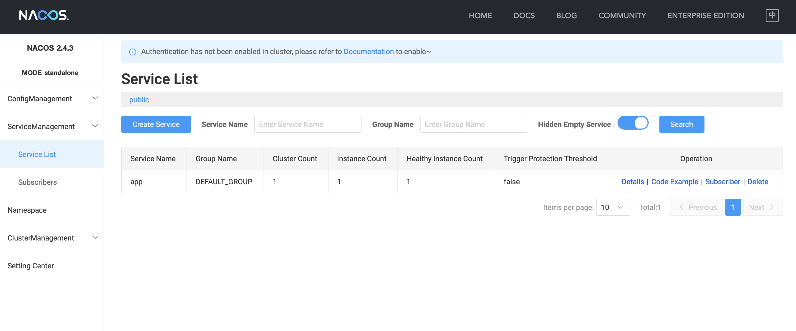
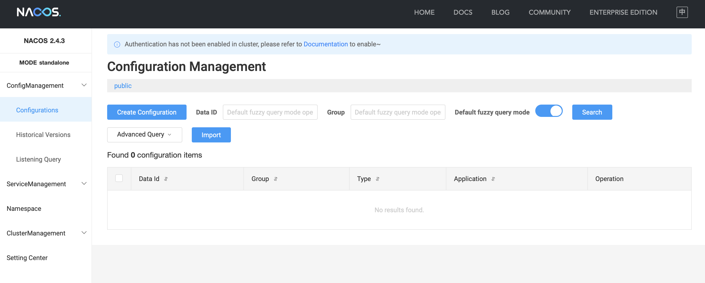
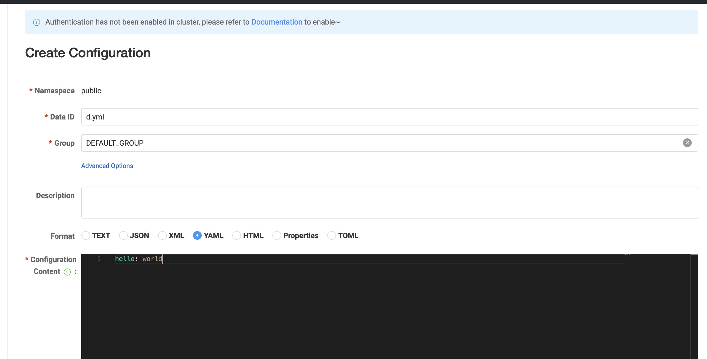

# 中间件速成 Ch25 Nacos 服务治理

现在我们补充一些中间件的使用。现在我们先从 Nacos 开始。Nacos 与我们之前学习过的 Consul 有一些相似之处。

## 启动并连接 Nacos

这里依然使用 docker 启动，按照 Nacos 官网的说明，使用以下命令启动，

```bash
git clone https://github.com/nacos-group/nacos-docker.git
cd nacos-docker
docker compose -f example/standalone-derby.yaml up
```

启动后，使用 `localhost:8848/nacos` 访问 Nacos 控制台。

要将 Spring Cloud 项目连接到 Nacos，添加

```groovy
implementation 'com.alibaba.cloud:spring-cloud-starter-alibaba-nacos-config:2023.0.3.2'
implementation 'com.alibaba.cloud:spring-cloud-starter-alibaba-nacos-discovery:2023.0.3.2'
implementation 'org.springframework.cloud:spring-cloud-starter-bootstrap:4.2.0'
```

其中第一个是用于服务配置的，第二个是用于服务发现的。这两个需要依赖 bootstrap 包，这个包的功能我们已经在前文介绍过了，用于区分 bootstrap 阶段的配置和实际应用的配置。所有启动应用必须的配置放在 bootstrap 配置文件中，所有应用的配置放在 application 配置文件中。不过这里我们不需要额外的配置文件，只需要在 `application.properties` 中配置即可。但是依然必须引入这个包。

然后配置， `spring.cloud:nacos.config.server-addr` 参数，填入 `localhost:8848`。

启动后，可以在 Nacos 控制台看到注册的服务。



之后服务调用和我们之前讲解的完全一致，启用负载均衡和可以直接使用服务名，不再需要额外的配置。

## Nacos 作为配置中心

### 使用 Value 注解

下面演示如何使用 Nacos 同步配置。依赖我们已经在上面添加了。

在 Nacos 控制台页面，此处选择配置列表，然后新建一个配置，填入配置名和配置内容。





创建配置页面的 Data ID 即文件名。

此外，Nacos 也提供了命名空间机制，可以用于区分不同的环境。这个功能在 Nacos 控制台的左上角可以看到。

然后在 Spring Cloud 项目中，添加，

```yaml
spring:
  config:
    import:
      - nacos:d.yml
```

如果需要指定命名空间和分组，使用，

```yaml
spring:
  cloud:
    nacos:
      config:
        namespace: 11111111-1111-1111-1111-111111111111
  config:
    import:
      - nacos:d.yaml?group=DEFAULT_GROUP
   
```

如果要实现 profile 区分，可以利用 yaml 的多文档特性，

```yaml
spring:
  profiles:
    active: dev
---
spring:
  config:
    import:
      - nacos:d.yml
    activate:
      on-profile: dev
```

现在创建一个 Controller 用于获取配置的参数，

```java
package com.github.fingerbone;

import org.springframework.web.bind.annotation.RestController;
import org.springframework.beans.factory.annotation.Value;
import org.springframework.context.annotation.Configuration;
import org.springframework.web.bind.annotation.GetMapping;


@RestController
@Configuration
public class TestController {
    @Value("${hello}")
    private String hello;

    @GetMapping("/hello")
    public String getHello() {
        return hello;
    }
     
}
```

现在打开网页测试，可以看到返回了配置中的内容。

同样的，我们可以使用 `@RefreshScope` 注解来实现配置的动态刷新。这点在之前的文章中已经讲过，这里不再赘述。

### 使用 ConfigurationProperties 注解

此外，还有一种方法可以批量简单地获取配置，即使用 `@ConfigurationProperties` 注解。这个注解可以将配置文件中的配置映射到一个类中，然后直接注入这个类即可。这一点我们之前没有讲过，在这里简单介绍一下。

在现在这个例子中，使用，

```java
@Data
@Component
@ConfigurationProperties(prefix = "")
public class Config {
    private String hello;
}
```

这样直接注入这个 Bean 即可。注意，这里不需要 `@RefreshScope` 注解，也会自动刷新。

此外，这个类中字段与配置文件的映射规则是 `prefix.field`，`prefix` 即注解里面的参数，`field` 是把类的驼峰命名的名称转换为 kebab-case 的名称。例如，`helloWorld` 对应 `hello-world`。只要配置文件中的配置符合这个规则，就可以直接注入。

### 监听配置变化

此外我们还可以添加配置变化的回调，只要向 `NacosConfigManager` 中添加监听器即可。

```java
@Bean
ApplicationRunner applicationRunner(NacosConfigManager nacosConfigManager) {
    return args -> {
        nacosConfigManager.getConfigService().addListener("d.yml", "DEFAULT_GROUP", new Listener() {
            @Override
            public void receiveConfigInfo(String configInfo) {
                System.out.println("Config changed: " + configInfo);
            }
            @Override
            public Executor getExecutor() {
                return Executors.newSingleThreadExecutor();
            }
        });
    };
}
```
