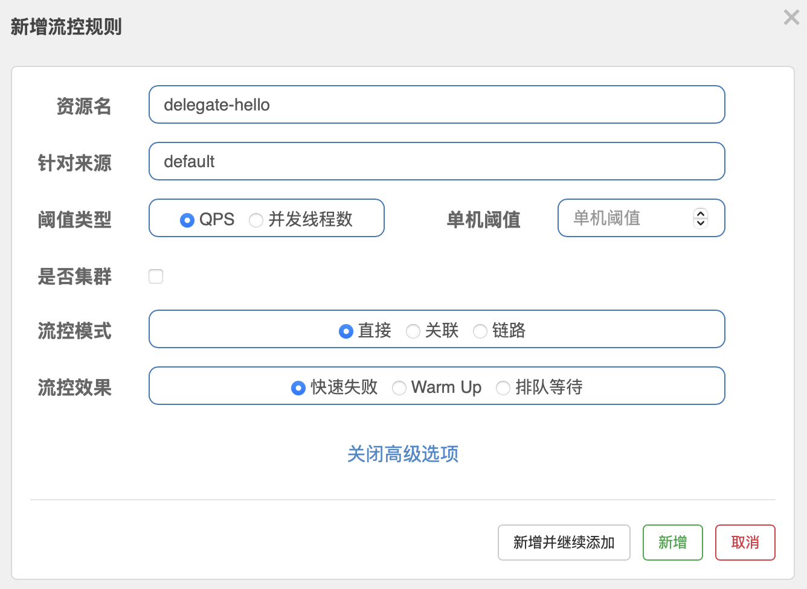

# 中间件速成 Ch26 Sentinel

Sentinel 是阿里巴巴开源的一款流量控制、熔断降级的 Java 中间件，它提供了一套完整的流量控制方案，包括流量控制、熔断降级、系统负载保护等功能。Sentinel 通过实时的监控系统的运行状态，对系统的流量进行实时的监控，当系统的流量超过了预设的阈值时，Sentinel 会对流量进行控制，保护系统的稳定运行。

相比 Resilience4j，Sentinel 提供了更多的流量控制策略，包括流量控制、熔断降级、系统负载保护等功能。Sentinel 通过实时的监控系统的运行状态，对系统的流量进行实时的监控，当系统的流量超过了预设的阈值时，Sentinel 会对流量进行控制，保护系统的稳定运行。

## Sentinel 的保护策略

Sentiel 保护策略如下。对于用户可以访问的每个资源，可以提供若干规则，例如流量控制，服务降级等。如果违反规则，则会抛出异常，进行 Fallback。否则直接放行。

可以看出，Sentinel 保护有三个关键点：定义资源，定义规则，Fallback 逻辑。

## Sentinel 使用

首先启动 Sentinel 的 Dashboard，这里需要在[这里](https://github.com/alibaba/Sentinel/releases)获取 jar 包，直接启动即可。默认账号与密码都是 Sentinel。

然后引入 Sentinel。此外为了演示，我们还引入 OpenFeign。Sentinel 有 OpenFeign 的集成，可以直接使用。

```groovy
implementation 'org.springframework.cloud:spring-cloud-starter-openfeign:4.2.0'
implementation 'com.alibaba.cloud:spring-cloud-starter-alibaba-sentinel:2023.0.3.2'
implementation 'org.springframework.cloud:spring-cloud-starter-loadbalancer:4.2.0'
```

现在我们再创建一个微服务，让新的微服务调用之前的微服务。这里我们使用 OpenFeign 来调用。

```java
package com.github.fingerbone;

import org.springframework.cloud.openfeign.FeignClient;
import org.springframework.web.bind.annotation.GetMapping;

@FeignClient(value = "app")
public interface TestClient {
    @GetMapping("/hello")
    public String hello();
}
```

```java
package com.github.fingerbone;

import org.springframework.beans.factory.annotation.Autowired;
import org.springframework.web.bind.annotation.RestController;
import org.springframework.web.bind.annotation.GetMapping;

@RestController
public class TestController {
   @Autowired
   private TestClient testClient;
   
   @GetMapping("/delegate")
   public String delegateHello() {
       return testClient.hello();
   }
   
}
```

现在直接启动即可。注意，Sentinel 是懒加载的，所以需要访问一次才能在 Dashboard 上看到。当然，也可以在配置文件中开启 eager 模式。此外还要配置 `spring.cloud.sentinel.transport.dashboard` 来指定 Dashboard 的地址。

```yaml
spring:
  cloud:
    sentinel:
      transport:
        dashboard: localhost:8080
      eager: true
```

此外，还要开启 Sentinel 的 Feign 整合。

```yaml
feign:
  sentinel:
    enabled: true
```

发送几个请求，然后就可以在 Dashboard 上看到了。

默认情况下，Sentinel 会把每一个 Web Endpoint 作为一个资源。如果开启了 Feign 整合，那么 Feign 的调用。

此外，还可以通过向方法上添加 `@SentinelResource` 注解来定义资源。注意，每一个有 `@SentinelResource` 注解的方法都会被 Sentinel 保护。

```java
@SentinelResource(value = "hello")
```

然后就可以直接在 Dashboard 上看到定义的资源。


不过注意，`@SentinelResouce` 注解应该加在非 Web Endpoint 的方法上，例如 Service 层的方法。

如果一个资源获取了另一个资源，在 Dashboard 上会有调用链的显示。

## Sentinel Fallback 机制

Sentinel 在触发时，会抛出 `BlockException` 异常。有四种情况来处理这个异常。

### Web 接口错误处理

Sentinel 会调用 `BlockExceptionHandler` 来处理异常。可以通过实现 `BlockExceptionHandler` 接口来自定义异常处理。

```java
public class CustomBlockExceptionHandler implements BlockExceptionHandler {
    @Override
    public void handle(
        HttpServletRequest request,
         HttpServletResponse response, 
         String resouceName,
         BlockException e) throws Exception {
        response.setStatus(429);
        response.getWriter().write("Too many requests");
    }
}
```

### @SentinelResource Fallback

对于 SentinelResouce 的 Fallback，可以通过 `fallback` 属性来指定 Fallback 方法。注意，还有一个参数 `blockHandler`，它的功能与 `fallback` 类似，但是它更优先。

```java
@SentinelResource(value = "hello", fallback = "fallback", blockHandler = "blockHandler")
public String hello() {
    return "Hello";
}

public String fallback(Throwable e) {
    return "Fallback";
}

public String blockHandler(BlockException e) {
    return "BlockHandler";
}
```

Fallback 或 BlockHandler 的函数参数比原本的函数多一个参数，即对应的 Exception。

当一个异常被抛出，如果是 BlockException，即 Sentinel 触发，那么会调用 BlockHandler，如果没有 BlockHandler，那么会调用 Fallback。如果没有 Fallback，那么会直接抛出异常到 Spring 全局异常处理器。

如果是其它类型的异常，会直接走 Fallback。

### OpenFeign Fallback

OpenFeign Fallback 走的是 OpenFeign 的 Fallback 返回，例如，

```java
package com.github.fingerbone;

import org.springframework.cloud.openfeign.FeignClient;
import org.springframework.web.bind.annotation.GetMapping;
@FeignClient(value = "app", fallback = TestClientFallback.class)
public interface TestClient {
    @GetMapping("/hello")
    public String hello();
}
```

```java
package com.github.fingerbone;

import org.springframework.stereotype.Component;

@Component
public class TestClientFallback implements TestClient {
    @Override
    public String hello() {
        return "Fallback";
    }
}
```

### SphU try-catch

最后一种方法是使用 `SphU` 的 `try-catch` 方法来处理异常。事实上，Sentinel 代理了原本的方法，每次调用时，都会使用 `SphU` 的 `try-catch` 方法来处理异常。

即对于一个受保护的函数 `func()`，实际执行过程如下，

```java
try {
    SphU.entry("func");
    func();
} catch (BlockException e) {
    // Fallback
}
```

## Sentinel 流量控制

下面介绍 Sentinel 三种基础保护机制的参数。

对于流量控制，有，



流控模式中，直接模式是指不考虑任何情况，只要访问资源的来源超过了阈值，就会触发流控。

链路策略模式要指定一个入口。只有来自入口的流量超过了阈值，才会触发流控。

使用链路模式，需要将 `spring.cloud.sentinel.web-context-unify` 设置为 `false`。否则，Sentinel 不会将不同 WebEndpoint 调用的同一个 Service 分列开。

最后是关联策略。关联策略的使用场景是写频繁时对读限流，没有写时对读不限流。关联模式可以指定一个关联的资源，只有关联的资源超过了阈值，自己也超过了阈值，才会触发流控。

此外还有三种流控效果，

快速失败模式是指只要触发流控，直接拒绝服务。

Warm Up 模式有一个额外的 Period 参数。在 Period 时间内，流量逐渐增加，直到达到阈值。增加是线性的，冷状态是 `QPS / Period` 个请求，之后秒增加到 `QPS` 个请求。

排队等待模式是指当流量超过阈值时，不直接拒绝服务，而是排队等待。这个模式需要指定一个等待时间 timeout，如果等待时间超过了，就会拒绝服务。

## Sentinel 熔断降级

熔断的作用是切断不稳定的调用链，使得某个服务快速 Fallback，以避免服务雪崩。否在，单个服务的不稳定可能会被放大导致整个系统的崩溃。

熔断降级用于远程调用部分，这里的原理已经在 Resilience4j 部分介绍过了，关于慢调用，异常比例，异常数等。

## Sentinel 热点参数限流

这一功能适用于对于某个访问频繁的参数，例如大卖的某个商品 ID，对于这个商品 ID 的访问频率超过了阈值，就会触发热点参数限流。这属于流量控制的更细粒度的控制，可以控制只对某个参数进行限流。
